## Java语言基础

### 1. 使用记事本乱码问题

> 乱码产生的原因：是因为记事本默认编码格式为UTF-8 而JVM默认文件的编码格式为GBK 最终原因也就是因为
>
> 编码格式不一致所导致
>
> 解决方案：将记事本文件 另存为===》选择编码格式为ANSI===》 保存 替换 即可
>
> UTF-8 Unicode编码 万国码 收录了世界上绝大多数国家的语言 
>
> GB2312 国标标准版 收录了绝大多数中文简体 
>
> GBK 国标扩展版 收录了绝大多数中文简体 以及繁体 
>
> ANSI 在不同的操作系统表示不同的编码格式 在中文操作系统下 表示GBK

```java
public class HelloWorld{
	public static void main(String [] args){
       
		System.out.print(System.getProperty("file.encoding"));  // 打印JVM默认文件编码格式
		System.out.print("hello world 666 世界你好");
		
	}
}
```

### 2.包的概念

> 包就是文件夹 用来对java文件分门别类的管理 更加方便  结构更加清晰
>
> 包名的命名规范：全部小写 域名倒置  不能以点开头或者结尾 只能包含点 每存在一个点 表示一个子文件夹
>
> 举例：  域名 www.baidu.com      包名 com.baidu.xxx
>
> 在包中所编写的类 必须使用package关键字声明当前类所在包  声明包的语句必须在java文件的第一行 
>
> 使用不再同包的类需要导包 使用import关键字导包 导包的语句必须在声明包之后 在声明类之前

### 3.注释

> 注释的作用/什么是注释：用于对代码进行解释说明的文字 就是注释 
>
> 注释不参与编译 即注释只会起到解释说明的作用 不会对代码本身产生任何影响

* 单行注释 

  ```java
  // 注释内容
  ```

* 多行注释

  ```java
  /*
  	注释内容1
  	注释内容2
  */
  ```

* 文档注释

  ```java
  /**
   *	注释内容
   *  注释内容
   */
  ```


```java
package com.atguigu.test1;

/**
 *  此类用于演示讲解文档注释
 *  这里属于文档注释 文档注释通常用来描述某个类
 *  或者某个方法实现了什么功能
 *  文档注释可以生成帮助文档
 *
 */
public class TestDocumentComment {

    /**
     *  此方法 为main方法
     *  main方法为程序的入口
     *  也就是程序如果需要执行 必须编写main方法
     *  main方法格式是固定的 缺一不可
     *
     */
    public static void main(String[] args) {

        /*
            以下代码用来实现打印内容
            print() 方法 没有换行效果
            println() ln 表示line单词的简写 表示打印一行 即打印完成会换行
         */
        System.out.println("hello world"); // 这行代码用来打印 hello world
    }
}

```

### 4.关于帮助文档

> 帮助文档 就相当于一个使用说明书 详细列举了每个类中的每个方法 每个属性 构造方法 等等 的介绍 
>
> 官方名称 API ： Application Program Interface
>
> 我们自己编写的类也可以通过命令生成帮助文档 ：javadoc -d . java文件名.java

### 5. 类的阐述

> 同一个源文件中可以定义多个类。
>
> 编译后，每个类都会生成独立的 .class文件。
>
> 一个类中，只能有一个main方法，每个类都可以有自己的main方法
>
> public修饰的类称为公开类，要求类名必须与文件名称完全相同，包括大小写。
>
> 一个源文件中，只能有一个公开类。

```java
package com.atguigu.test2;

/**
 * @author WHD
 * @description TODO
 * @date 2023/7/26 14:09
 *  同一个源文件中可以定义多个类。
 *  编译后，每个类都会生成独立的 .class文件。
 *  一个类中，只能有一个main方法，每个类都可以有自己的main方法
 *  public修饰的类称为公开类，要求类名必须与文件名称完全相同，包括大小写。
 *  一个源文件中，只能有一个公开类。
 */
public class ClassDescription {
    public static void main(String[] args) {
        System.out.println("TestClassDescription print");
    }
}

class B{
    public static void main(String[] args) {
        System.out.println("B class print");
    }
}

class C{
    public static void main(String[] args) {
        System.out.println("C class print");
    }
}
```

## 变量

### 1.变量的概念

> **`变量就是用来记录数据的`**
>
> 生活中 我们通常需要记录数据 并且记录数据的方式、途径多种多样 程序中 也通常需要记录数据 程序中 通过
>
> 变量类记录数据。
>
> 举例：比如你需要大宝剑，发现钱不够，找你的同桌借5毛钱。
>
> 时间：2023年7月26日14:47:07
>
> 人物：你的同桌
>
> 事件：借钱
>
> 金额：0.5元 / 5毛
>
> 生活中的数据有不同的数据类型，程序中亦是如此  不同的数据使用不同的类型来存储。

### 2.变量的定义方式

> 变量的定义
>
> 三种方式
>
> 方式1： 先声明 再赋值
>
> 方式2： 连声明 带赋值 写为一条语句
>
> 方式3： 同时声明多个同类型的变量(了解) 实际开发中不推荐使用 因为阅读性较差
>
>
> 同时注释多行代码：选中代码 ctrl + /
>
> 自动对齐/格式化代码 ： ctrl + alt + L
>
> 红色波浪线：鼠标移动上去 查看报错信息

```java
package com.atguigu.test3;

/**
 * @author WHD
 * @description TODO
 * @date 2023/7/26 14:57
 * 变量的定义
 * 三种方式
 * 方式1： 先声明 再赋值
 * 方式2： 连声明 带赋值 写为一条语句
 * 方式3： 同时声明多个同类型的变量(了解) 实际开发中不推荐使用 因为阅读性较差
 *
 * 同时注释多行代码：选中代码 ctrl + /
 * 自动对齐/格式化代码 ： ctrl + alt + L
 * 红色波浪线：鼠标移动上去 查看报错信息
 */
public class TestVariableDefine {
    public static void main(String[] args) {
        // 方式1： 先声明 再赋值
        int a;
        a = 100;
        System.out.println("变量a的取值为：" + a);

        // 方式2： 连声明 带赋值 写为一条语句
        int b = 123;
        System.out.println("变量b的取值为：" + b);

        // 方式3： 同时声明多个同类型的变量(了解)
        // 未赋值的局部变量是不能使用的
        int c, d, e = 55, f, g = 66;
        System.out.println("变量e的取值为：" + e);
        System.out.println("变量g的取值为：" + g);
//        System.out.println("变量c的取值为：" + c);
//        System.out.println("变量d的取值为：" + d);
//        System.out.println("变量f的取值为：" + f);


    }
}

```

### 3. 数据类型

#### 3.1 整数类型

> 整数类型四种
>
> byte    1个字节8位 -128 ~ 127
>
> short   2个字节16位 -32768 ~ 32767
>
> int     4个字节32位 -2147483648 ~ 2147483647
>
> long    8个字节64位
>
>
> Java中的每一个数据都有其对应的数据类型
>
> 整数对应int类型
>
> int为整数的默认类型，如需为long类型赋值
> 如果取值范围超出了int 则需要在值的后面追加“L”
>  如果取值范围在int范围以内 则可加 可不加

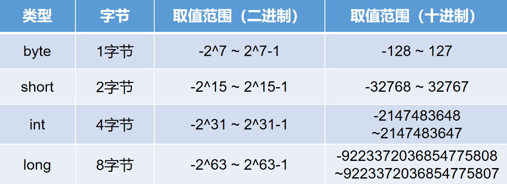

```java
package com.atguigu.test4;

/**
 * @author WHD
 * @description TODO
 * @date 2023/7/26 15:47
 *  整数类型四种
 *  byte    1个字节8位 -128 ~ 127
 *  short   2个字节16位 -32768 ~ 32767
 *  int     4个字节32位 -2147483648 ~ 2147483647
 *  long    8个字节64位
 *
 *  Java中的每一个数据都有其对应的数据类型
 *  整数对应int类型
 *
 *
 */
public class TestNumberType {
    public static void main(String[] args) {
        byte b1 = 100;
        System.out.println("b1的取值为：" + b1); // sout 回车 自动生成输出语句

        byte b2 = -123;
        System.out.println("b2 = " + b2); // soutv 自动生成打印上一行变量的输出语句

//        byte b3 = -129;
//        System.out.println("b3 = " + b3);

        System.out.println("----------------------------------------------");

        short s1 = 8956;
        System.out.println("s1 = " + s1);

        short s2 = -23451;
        System.out.println("s2 = " + s2);

//        short s3 = -32769;
        System.out.println("----------------------------------------------");

        int i1 = 895645;
        System.out.println("i1 = " + i1);

        int i2 = -561245;
        System.out.println("i2 = " + i2);

//        int i3 = 2147483648;

        System.out.println("----------------------------------------------");

        // int为整数的默认类型，如需为long类型赋值
        // 如果取值范围超出了int 则需要在值的后面追加“L”
        // 如果取值范围在int范围以内 则可加 可不加
        long l1 = 567854651;
        System.out.println("l1 = " + l1);

        long l2 = -45127856;
        System.out.println("l2 = " + l2);

        long l3 = 2147483648L;
        System.out.println("l3 = " + l3);

        long l4 = 100;


    }
}

```


#### 3.2 浮点类型

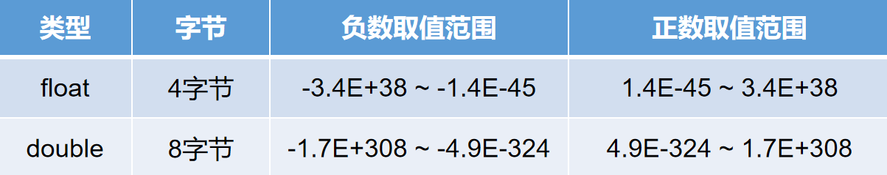

> 浮点类型 ： 这两种类型都是近似值 不是精确值 如需精确值 使用后续学习的 BigDecimal类
>
> float  负数 -3.4E+38 ~ -1.4E-45  正数 1.4E-45 ~ 3.4E+38
>
> double 负数 -1.7E+308 ~ -4.9E-324  正数 4.9E-324 ~ 1.7E+308

```java
package com.atguigu.test1;

/**
 * @author WHD
 * @description TODO
 * @date 2023/7/28 9:17
 *  浮点类型 ： 这两种类型都是近似值 不是精确值 如需精确值 使用后续学习的 BigDecimal类
 *  float  负数 -3.4E+38 ~ -1.4E-45  正数 1.4E-45 ~ 3.4E+38
 *  double 负数 -1.7E+308 ~ -4.9E-324  正数 4.9E-324 ~ 1.7E+308
 *
 *
 *
 */
public class TestFloatDouble {
    public static void main(String[] args) {
        float f1 = -340000000000000000000000000000000000000F;
        System.out.println("f1 = " + f1);


        float f2 = -0.0000000000000000000000000000000000000000000014F;
        System.out.println("f2 = " + f2);

        float f3 = 0.0000000000000000000000000000000000000000000014F;
        System.out.println("f3 = " + f3);

        float f4 = 340000000000000000000000000000000000000F;
        System.out.println("f4 = " + f4);


        // 给double类型赋值 如果取值范围超出了float的取值范围 必须在末尾加上D 推荐大写
        double d1 = 2.5;
        System.out.println("d1 = " + d1);

        double d2 = 3.6;
        System.out.println("d2 = " + d2);

    }
}
```


#### 3.3 布尔类型

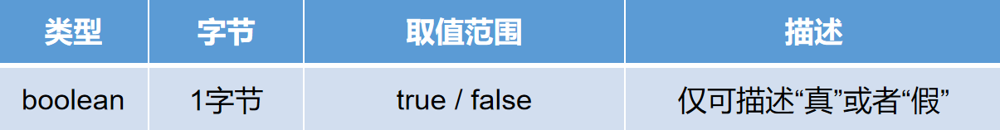

> boolean类型 仅能描述true 或者 false
>
> true表示为真 false表示为假
>
> boolean类型可以直接赋值 true 或者 false 也可以赋值 最终结果为true或者false 的表达式

```java
package com.atguigu.test1;

/**
 * @author WHD
 * @description TODO
 * @date 2023/7/28 9:33
 *  boolean类型 仅能描述true 或者 false
 *  true表示为真 false表示为假
 *  boolean类型可以直接赋值 true 或者 false 也可以赋值 最终结果为true或者false 的表达式
 */
public class TestBoolean {
    public static void main(String[] args) {
        boolean bl1 = true;
        System.out.println("bl1 = " + bl1);
        boolean bl2 = false;
        System.out.println("bl2 = " + bl2);

        int a = 10;
        int b = 20;
        boolean bl3 = a > b;
        System.out.println("bl3 = " + bl3);

        boolean bl4 = a < b;
        System.out.println("bl4 = " + bl4);
    }
}

```


#### 3.4 字符类型

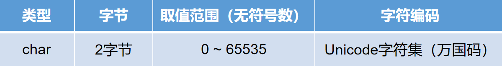

> char类型 2个字节  取值范围 无符号数 0 ~ 65535
>
> 赋值方式1 直接使用英文的单引号包括任意一个内容
>
> 赋值方式2 直接赋值在0~65535以内的整数
>
> 赋值方式3 使用英文单引号包括十六进制的Unicode字符值  必须以杠u开头

```java
package com.atguigu.test1;

/**
 * @author WHD
 * @description TODO
 * @date 2023/7/28 9:40
 *  char类型 2个字节  取值范围 无符号数 0 ~ 65535
 */
public class TestChar {
    public static void main(String[] args) {
        // 赋值方式1 直接使用英文的单引号包括任意一个内容
        char ch1 = 'a';
        System.out.println("ch1 = " + ch1);
        char ch2 = '1';
        System.out.println("ch2 = " + ch2);
        char ch3 = '中';
        System.out.println("ch3 = " + ch3);
        char ch4 = '!';
        System.out.println("ch4 = " + ch4);
        char ch5 = '~';
        System.out.println("ch5 = " + ch5);

        System.out.println("--------------------------------------------------");


        // 赋值方式2 直接赋值在0~65535以内的整数
        // ASCII 美国标准信息交换码  0 ~ 127
        char ch6 = 65;
        System.out.println("ch6 = " + ch6); // A

        char ch8 = 66;
        System.out.println("ch8 = " + ch8); // B

        char ch9 = 67;
        System.out.println("ch9 = " + ch9);

        char ch7 = 97;
        System.out.println("ch7 = " + ch7); // a

        char ch10 = 48;
        System.out.println("ch10 = " + ch10);


        // 中文汉字 以及 中文标点符号 将参考Unicode编码表  Unicode编码表是一个十六进制的编码表
        // 记录了世界上绝大多数国加的语言 中文的取值范围是 ： \u4e00(19968) ~ \u9fa5(40869)
        char ch11 = 20013;
        System.out.println("ch11 = " + ch11);

        char ch12 = 20320;
        System.out.println("ch12 = " + ch12);

        char ch13 = 19967;
        System.out.println("ch13 = " + ch13);

        char ch14 = 19968;
        System.out.println("ch14 = " + ch14);

        char ch15 = 19969;
        System.out.println("ch15 = " + ch15);

        char ch16 = 40869;
        System.out.println("ch16 = " + ch16);


        System.out.println("-----------------------------------------------");

        // 赋值方式3 使用英文单引号包括十六进制的Unicode字符值  必须以杠u开头

        char c1 = '\u4e2d';
        System.out.println("c1 = " + c1);


        char c2 = '\u4e00';
        System.out.println("c2 = " + c2);

    }
}
```

### 4. 转义字符

> 转义字符 : 可以用于保存一些特殊符号 或者 实现一些 特殊的效果

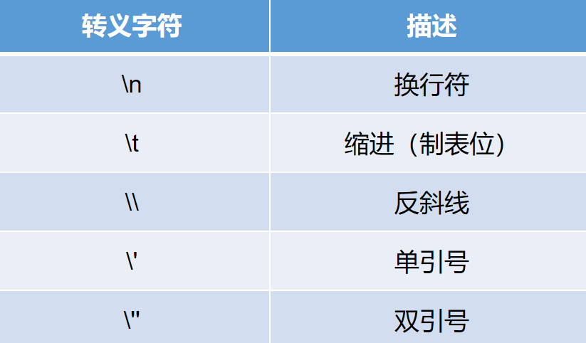

```java
package com.atguigu.test2;

/**
 * @author WHD
 * @description TODO
 * @date 2023/7/28 10:41
 *  转义字符 : 可以用于保存一些特殊符号 或者 实现一些 特殊的效果
 */
public class TestConvertSign {
    public static void main(String[] args) {
        char ch1 = '\'';

        System.out.println("ch1 = " + ch1);


        // \n 换行 println 和  \n 都可以换行
        System.out.println("a\nb\nc\nd\ne\nf\ng");


        // \t 制表位 可以保证在大多数情况 上下行文本对齐
        System.out.println("春\t风\t得\t意\t马\t蹄\t疾");
        System.out.println("一\t日\t看\t尽\t长\t安\t花");

        // \\ 保存一个反斜线  需要写两个 第一个用来转义 第二个才是保存的内容
        char ch2 = '\\';
        System.out.println("ch2 = " + ch2);

        // \" 如果使用char类型保存一个英文的双引号 是否转义都可以保存
        char ch3 = '"';
        System.out.println("ch3 = " + ch3);

        char ch4 = '\"';
        System.out.println("ch4 = " + ch4);


        String str = "\"";


    }
}

```

### 5. String类型

> String类型  String是JDK提供的一个类 属于引用数据类型  任何英文双引号包括的内容 都是字符串

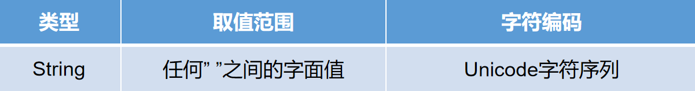

```java
package com.atguigu.test2;

/**
 * @author WHD
 * @description TODO
 * @date 2023/7/28 10:55
 *  String类型  String是JDK提供的一个类 属于引用数据类型  任何英文双引号包括的内容 都是字符串
 */
public class TestString {
    public static void main(String[] args) {
        String str1 = "abc";
        String str2 = "1234";
        String str3 = "创奇那明月";
        String str4 = "dsadsa wqe  213  543  dcs c s  打撒打撒的速度完全额完全人不成熟";

        String str5 = "\"\"";

        char ch1 = '\''; // char只能保存任意  一个   字符

    }
}
```

### 6. 课堂代码阅读

> 代码阅读：赋值  取值范围有冲突的两个类型 不能直接赋值 

```java
package com.atguigu.test2;

/**
 * @author WHD
 * @description TODO
 * @date 2023/7/28 11:01
 *  代码阅读：赋值  取值范围有冲突的两个类型 不能直接赋值 
 */
public class TestExercise {
    public static void main(String[] args) {
        short s1 = -1; // short 2个字节 -32768 ~ 32767
        char ch1 = (char)s1; // char 2个字节   0 ~ 65535
        System.out.println("ch1 = " + ch1);
    }
}

```

### 7. 类型转换

> 自动提升 手动下降

#### 7.1 自动类型转换

> 自动类型转换：自动类型提升
>
> 1.两种类型要相互兼容 数值与数值类型之间相互兼容 short 兼容 byte 、 int兼容short等等
>
> 2.目标类型(等号左边)取值范围大于源类型(等号右边)取值范围

````java
package com.atguigu.test2;

/**
 * @author WHD
 * @description TODO
 * @date 2023/7/28 11:09
 *  自动类型转换：自动类型提升
 *  1.两种类型要相互兼容 数值与数值类型之间相互兼容 short 兼容 byte 、 int兼容short等等
 *  2.目标类型(等号左边)取值范围大于源类型(等号右边)取值范围
 */
public class TestAutoConvert {
    public static void main(String[] args) {
        byte b1 = 10;
        short s1 = b1;
        System.out.println("s1 = " + s1);

        short s2 = 2356;
        int i1 = s2;
        System.out.println("i1 = " + i1);

        int i2 = 895645;
        long l1 = i2;
        System.out.println("l1 = " + l1);

        long l2 = 56231245L;
        float f1 = l2;
        System.out.println("f1 = " + f1);

        float f2 = 3.5F;
        double d1 = f2;
        System.out.println("d1 = " + d1);

        byte b2 = 100;

        short e = b2;
        int a = b2;
        long b = b2;
        float c = b2;
        double d = b2;


    }
}

````

#### 7.2 强制类型转换

> 强制类型转换：
>
> 1.两种类型要相互兼容 数值与数值之间相互兼容
>
> 2.目标类型(等号左边)取值范围小于源类型(等号右边)

```java
package com.atguigu.test3;

/**
 * @author WHD
 * @description TODO
 * @date 2023/7/28 11:39
 *  强制类型转换：
 *  1.两种类型要相互兼容 数值与数值之间相互兼容
 *  2.目标类型(等号左边)取值范围小于源类型(等号右边)
 */
public class TestForceConvert {
    public static void main(String[] args) {
        short s1 = 100;
        byte b1 = (byte)s1;
        System.out.println("b1 = " + b1);

        int i1 = 100;
        short s2 = (short)i1;
        System.out.println("s2 = " + s2);

        long l1 = 123;
        int i2 = (int)l1;
        System.out.println("i2 = " + i2);

        float f1 = 3.5F; // 将浮点类型强制转换为整数类型 小数点之后全部抹去
        long l2 = (long)f1;
        System.out.println("l2 = " + l2);

        double d1 = 3.5;
        float f2 = (float)d1;
        System.out.println("f2 = " + f2);


        double d2 = 2.5;
        long l3 = (long)d2;
        int i3 = (int)d2;
        short s3 = (short)d2;
        byte b3 = (byte)d2;

        char ch1 = (char)d2;
    }
}
```

#### 7.3 强制类型转换特殊情况

> 强制类型转换特殊情况：将超出目标类型的数值进行转换
>
>
> 原码 反码 补码
>
> 计算机统一以补码的形式表示所有的整数 正数的原返补码都一样(三码合一)
>
>
> 原码 即我们人能够直接看明白的表示形式 符号位为0表示正数 为1表示负数 其余位对应的十进制数值进行累计
>
> 反码 在原码的基础之上 符号位不变 其余各位取反 (是0改为1  是1改为0)
>
> 补码 在反码的基础之上 + 1

```java
package com.atguigu;

/**
 * @author WHD
 * @description TODO
 * @date 2023/7/28 14:01
 *  强制类型转换特殊情况：将超出目标类型的数值进行转换
 *
 *  原码 反码 补码
 *  计算机统一以补码的形式表示所有的整数 正数的原返补码都一样(三码合一)
 *
 *  原码 即我们人能够直接看明白的表示形式 符号位为0表示正数 为1表示负数 其余位对应的十进制数值进行累计
 *  反码 在原码的基础之上 符号位不变 其余各位取反 (是0改为1  是1改为0)
 *  补码 在反码的基础之上 + 1
 *
 */
public class TestForceConvertSpecial {
    public static void main(String[] args) {
        short s1 = 257;
        byte b1 = (byte)s1;
        System.out.println("b1 = " + b1); // 1

        short s2 = 128;
        byte b2 = (byte)s2;
        System.out.println("b2 = " + b2); // -128

        short s3 = 129;
        byte b3 = (byte) s3;
        System.out.println("b3 = " + b3); // -127


    }
}

```

### 8. 关于自动类型提升

> 涉及到运算符操作
>
> 进行算数运算时：
> 两个操作数有一个为double，计算结果提升为double。
> 如果操作数中没有double，有一个为float，计算结果提升为float。
> 如果操作数中没有float，有一个为long，计算结果提升为long。
> 如果操作数中没有long，有一个为int，计算结果提升为int。
> 如果操作数中没有int，均为short或byte或者char，计算结果仍旧提升为int。
>
> `总结：多个操作数进行数学计算，结果提升为这些操作数中取值范围最大的类型，如果均为byte、short、char则结果提升为int类型。`
> 特殊：任何类型与String相加（+）时，实为拼接，其结果为String。

### 9.运算符

#### 9.1 算数运算符

> 算数运算符：+ - * / %
>
> 求余数 注意跟除法的区别

> ++ 和 --
>  ++表示自增1
>  --表示自减1
>  ++ 或者 -- 如果是单独作为一条语句书写 在前在后没有区别
>  如果不是单独作为一条语句书写 在前在后有区别
>  如果++ 或者 -- 在前， 先执行++ 或者 -- ，再执行其他的
>  如果++ 或者 -- 在后， 先执行其他的，再执行++或者--

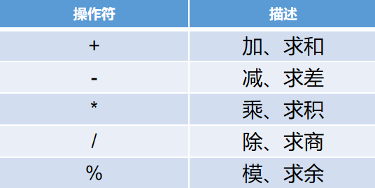

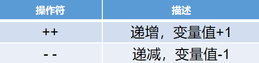

```java
package com.atguigu.test3;

/**
 * @author WHD
 * @description TODO
 * @date 2023/7/28 14:44
 *  算数运算符：+ - * / %
 */
public class TestMathOperator {
    public static void main(String[] args) {
        int a = 10;
        int b = 20;
        System.out.println(a + b); // 30
        System.out.println(a - b); // -10
        System.out.println(a * b); // 200
        System.out.println(a / b); // 0
        int c = 5;
        System.out.println(a % c); // 求余数 注意跟除法的区别

        System.out.println("-----------------------------------------------------");

        // ++ 和 --
        // ++表示自增1
        // --表示自减1
        // ++ 或者 -- 如果是单独作为一条语句书写 在前在后没有区别
        // 如果不是单独作为一条语句书写 在前在后有区别
        // 如果++ 或者 -- 在前， 先执行++ 或者 -- ，再执行其他的
        // 如果++ 或者 -- 在后， 先执行其他的，再执行++或者--
        int d = 10;
        d++; // 结果等同于 d = d + 1;
        System.out.println("d = " + d); // 11

        int e = 10;
        ++e;
        System.out.println("e = " + e); // 11

        int f = 10;
        f--;
        System.out.println("f = " + f);

        int g = 10;
        --g;
        System.out.println("g = " + g);

        System.out.println("-----------------------------------------------------");

        int h = 10;
        int i = h++;
        System.out.println("i = " + i);
        System.out.println("h = " + h);

        System.out.println("-----------------------------------------------------");

        int j = 10;
        int k = ++j;
        System.out.println("k = " + k);
        System.out.println("j = " + j);

    }
}

```

#### 9.2 赋值运算符

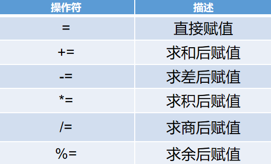

```java
package com.atguigu.test5;

/**
 * @author WHD
 * @description TODO
 * @date 2023/7/28 15:36
 *  赋值运算符： = += -= *= /= %=
 */
public class TestAssignmentOperator {
    public static void main(String[] args) {
        int a = 10;
        a += 10; // 结果 a = a + 10; 20
        System.out.println("a = " + a);
        a -= 5; // a = a - 5;  15
        System.out.println("a = " + a);
        a *= 10; // a = a * 10; 150
        System.out.println("a = " + a);
        a /= 2; // a = a / 2; 75
        System.out.println("a = " + a);
        a %= 3; // a = a % 3; 0
        System.out.println("a = " + a);

        System.out.println("-----------------------------------");

        short s1 = 10;
        s1 += 10; // 这里JVM帮我们实现 隐式 的类型转换
        System.out.println("s1 = " + s1);

        short s2 = 10;
        s2 = (short) (s2 + 10); // 这里因为是我们完整书写表达式进行计算 和 赋值 所以 需要手动类型转换

    }
}
```

####  9.3 关系运算符

> 关系运算符：>,<,>=,<=,==,!= 关系运算符最终的结果为布尔类型 表示两个操作数或者两个表达式之间的
>
> 关系 是否成立
>
>
> ctrl + d 复制当前光标所在行代码

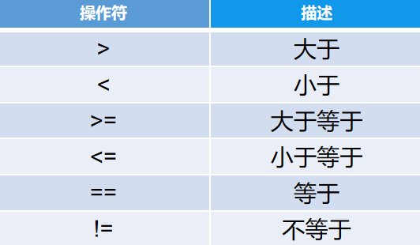

```java
package com.atguigu.test5;

/**
 * @author WHD
 * @description TODO
 * @date 2023/7/28 15:45
 *  关系运算符：>,<,>=,<=,==,!= 关系运算符最终的结果为布尔类型 表示两个操作数或者两个表达式之间的
 *  关系 是否成立
 *
 *  ctrl + d 复制当前光标所在行代码
 *
 */
public class TestRelationOperator {
    public static void main(String[] args) {
        int a = 10;
        int b = 20;
        System.out.println(a > b); // false
        System.out.println(a < b); // true
        System.out.println(a >= b); // false
        System.out.println(a <= b); // true
        System.out.println(a == b); // false
        System.out.println(a != b); // true
    }
}

```

#### 9.4 逻辑运算符

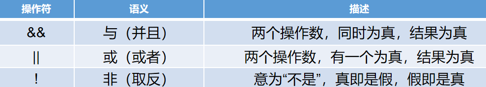

> &   与       要求两个或者多个条件同时成立 则最终结果为true
>
> 没有短路的效果 不管前边的条件结果如何 都将执行完所有的条件
>
>
> &&  短路与    要求两个或者多个条件同时成立 则最终结果为true
>
> 短路与 有短路的效果 如果前边的条件不成立 则后续的条件不再执行
>
>
>
> |   或        要求两个或者多个条件 至少有一个成立 则最终结果为true
>
> 没有短路的效果  不管前边的条件结果如何 都将执行完所有的条件
>
>
> ||  短路或    要求两个或者多个条件 至少有一个成立 则最终结果为true
>
> 短路或 有短路的效果 如果前边的条件 已经成立 则后续的不再执行
>
>
>
> !   非        取反

```java
package com.atguigu.test5;

/**
 * @author WHD
 * @description TODO
 * @date 2023/7/28 15:54
 *  逻辑运算符：
 *  &   与       要求两个或者多个条件同时成立 则最终结果为true
 *  没有短路的效果 不管前边的条件结果如何 都将执行完所有的条件
 *
 *  &&  短路与    要求两个或者多个条件同时成立 则最终结果为true
 *  短路与 有短路的效果 如果前边的条件不成立 则后续的条件不再执行
 *
 *
 *  |   或        要求两个或者多个条件 至少有一个成立 则最终结果为true
 *  没有短路的效果  不管前边的条件结果如何 都将执行完所有的条件
 *
 *  ||  短路或    要求两个或者多个条件 至少有一个成立 则最终结果为true
 *  短路或 有短路的效果 如果前边的条件 已经成立 则后续的不再执行
 *
 *
 *  !   非        取反
 *
 *  移动整行代码 ：shift + alt + ↑↓
 *
 */
public class TestLogicOperator {
    public static void main(String[] args) {
        int a = 10;
        int b = 20;
        int c = 10;

        System.out.println(a < b & b > c ); // true
        System.out.println(a < b && b > c ); // true

        System.out.println("-------------------------------------");

        System.out.println(a < b & b < c); // false
        System.out.println(a < b && b < c); // false

        System.out.println("-------------------------------------");

        System.out.println(a < b | b > c ); // true
        System.out.println(a < b || b > c ); // true

        System.out.println("-------------------------------------");

        System.out.println(a < b | b < c); // true
        System.out.println(a < b || b < c); // true

        System.out.println("-------------------------------------");

        System.out.println(a > b | b > c); // true
        System.out.println(a > b || b > c); // true

        System.out.println("-------------------------------------");

        System.out.println(a > b | b < c); // false
        System.out.println(a > b || b < c); // false


        System.out.println("-------------------------------------");

        boolean flag1 = true;
        System.out.println(!flag1);

        boolean flag2 = false;
        System.out.println(!flag2);

    }
}
```

> 逻辑运算符综合练习题：结合++和--

```java
package com.atguigu.test5;

/**
 * @author WHD
 * @description TODO
 * @date 2023/7/28 16:06
 * 逻辑运算符综合练习题：结合++和--
 */
public class TestLogicOperatorExercise {
    public static void main(String[] args) {
        int x = 8;
        int y = 9;
        System.out.println((++x == y) && (++x != y)); // true
        System.out.println(x); // 10

        int a = 8;
        int b = 9;
        System.out.println((a++ == b) && (++a != b)); // false
        System.out.println(a); // 9


        int c = 8;
        int d = 9;
        System.out.println((c++ == d) & (++c != d)); // false
        System.out.println(c); // 10

        System.out.println("------------------------------------------------------");

        int e = 8;
        int f = 9;
        System.out.println((++e == f) || (++e != f)); // true
        System.out.println(e); // 9

        int j = 8;
        int k = 9;
        System.out.println((++j == k) | (++j != k)); // true
        System.out.println(j); // 10
    }
}

```


#### 9.5 三目运算符

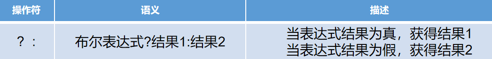

> 三元(目)运算符 ： 根据布尔表达式的结果选择执行 结果1  或者 结果2

```java
package com.atguigu.test5;

/**
 * @author WHD
 * @description TODO
 * @date 2023/7/28 16:16
 *  三元(目)运算符 ： 根据布尔表达式的结果选择执行 结果1  或者 结果2
 */
public class TestThreeElementOperator {
    public static void main(String[] args) {
        int age = 19;
        System.out.println(age >= 18 ? "成年了" : "未成年");

        int a = 1;
        int b = a > 5 ? 55 : 66;
        System.out.println("b = " + b);


    }
}

```

#### 9.6 位运算符

> 位运算符
>
> << 左移 : 左移几位表示乘以2的几次方 有可能会出现负数的情况
>
> '>>' 右移 : 右移几位表示除以2的几次方
>
> 如果最高位是1 则移动完以后 空缺位补1
>
> 如果最高位是0 则移动完以后 空缺位补0
>
> '>>>' 无符号右移 不管最高位是0还是1 空缺位统一以0填充 即 最终的结果都是一个正数
>
> 应用场景：比如我们要获取某个元素应该存放在数组中的位置 可以使用无符号右移 因为 无符号右移绝对不可能
>
> 得到一个负数 而数组的下标 也不为负数
>
>
> & 与 两个数 相同二进制位进行与运算  都为1 则结果为1 其他情况最终结果都为0
>
> | 或 两个数 相同二进制位进行或运算 只要有一个为1 或者两个都为1   则结果为1 其他的情况结果为0
>
> ^ 异或 找不同 相同二进制位 不同则结果为1 相同则结果为0
>
> ~ 取反 包括符号位在内 每一位取反 是0改为1 是1改为0


```java
package com.atguigu.test1;

/**
 * @author WHD
 * @description TODO
 * @date 2023/7/29 9:47
 *  位运算符
 *  << 左移 : 左移几位表示乘以2的几次方 有可能会出现负数的情况
 *  >> 右移 : 右移几位表示除以2的几次方
 *      如果最高位是1 则移动完以后 空缺位补1
 *      如果最高位是0 则移动完以后 空缺位补0
 *  >>> 无符号右移 不管最高位是0还是1 空缺位统一以0填充 即 最终的结果都是一个正数
 *  应用场景：比如我们要获取某个元素应该存放在数组中的位置 可以使用无符号右移 因为 无符号右移绝对不可能
 *  得到一个负数 而数组的下标 也不为负数
 *
 *  & 与 两个数 相同二进制位进行与运算  都为1 则结果为1 其他情况最终结果都为0
 *  | 或 两个数 相同二进制位进行或运算 只要有一个为1 或者两个都为1   则结果为1 其他的情况结果为0
 *  ^ 异或 找不同 相同二进制位 不同则结果为1 相同则结果为0
 *  ~ 取反 包括符号位在内 每一位取反 是0改为1 是1改为0
 *
 *
 *
 */
public class TestBitOperator {
    public static void main(String[] args) {
        int a = 1;
        System.out.println(a << 1); // 2
        System.out.println(a << 2); // 4
        System.out.println(a << 3); // 8
        System.out.println(a << 4); // 16
        System.out.println(a << 31);
        System.out.println(a << 32);

        System.out.println("------------------------------------------");

        System.out.println(8 >> 1);
        System.out.println(8 >> 2);
        System.out.println(8 >> 3);
        System.out.println(8 >> 4);


        System.out.println(-20 >> 1); // -10
        System.out.println(-20 >> 2); // -5

        System.out.println("------------------------------------------");

        System.out.println(8 >>> 1);
        System.out.println(8 >>> 2);
        System.out.println(8 >>> 3);
        System.out.println(8 >>> 4);


        System.out.println(-20 >>> 1); //
        System.out.println(-20 >>> 2); //

        System.out.println("------------------------------------------");

        System.out.println(25 & 21); // 17

        System.out.println(25 | 21); // 29

        System.out.println(25 ^ 21); // 12


        System.out.println(~5);

        System.out.println(~-6);


    }
}

```

### 10.标识符命名规范

> 凡是需要自定义名称的内容 都属于标识符
>
> 注意：标识符名称定义不要与Java关键字、保留字冲突
>
> 字(字母) 下(下划线) 美(美元符号) 人(人民币符号) 数(数字) 骆驼(驼峰命名) 
>
> 可以以字母 、下划线、美元符号、人民币符号开头，可以包含数字，不能以数字开头 实际开发中只推荐使用单词  
>
> 类名：由一个或者多个单词组成 ，每个单词首字母大写 举例： Student StringBuffer StringBuilder （大写驼峰）
>
>
>
> 变量名： 举例：studentName   studentAge  personWorkAge  （小写驼峰）
>
>
>
>
>
> 见名知义 有意义 
>
> 实际开发中只推荐使用单词  

### 11.常量

> 程序中无法改变的数据 称之为常量(后续会在接口部分进行详细讲解)

```java
package com.atguigu.test2;

/**
 * @author WHD
 * @description TODO
 * @date 2023/7/29 11:31
 *  常量： 程序中无法改变的数据 称之为常量
 */
public class TestConstant {
    public static void main(String[] args) {
        int a = 100;
        a = 1;


        System.out.println(100);
        System.out.println(1.5);
        System.out.println(2.5F);
        System.out.println('a');
        System.out.println(true);
        System.out.println(false);
        System.out.println("false");
    }
}

```

### 12.局部变量

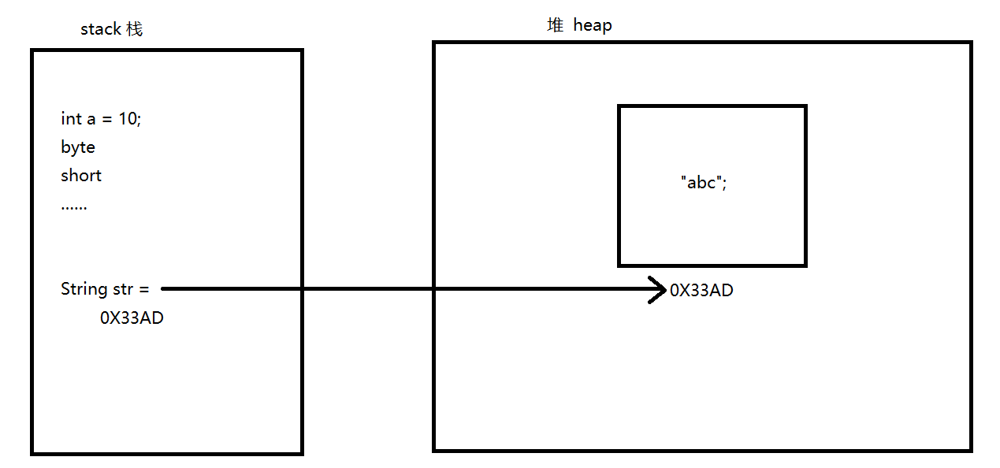

| 局部变量   | 描述                                                  |
| ---------- | ----------------------------------------------------- |
| 定义位置： | 定义在方法体内                                        |
| 作用范围： | 离当前变量最近的大括号以内                            |
| 重名问题： | 重合的作用范围以内 不能重名                           |
| 默认值：   | 局部变量没有默认值 必须先赋值才能使用                 |
| 生命周期： | 随着方法的入栈(压栈)而生效 随着方法的出栈(弹栈)而死亡 |
| 存储位置： | 基本数据类型存在栈中  引用数据类型 名字在栈 值在堆    |

```java
package com.atguigu.test2;

/**
 * @author WHD
 * @description TODO
 * @date 2023/7/29 11:34
 *  局部变量：
 *      定义位置：定义在方法体内
 *      作用范围：离当前变量最近的大括号以内
 *      重名问题：重合的作用范围以内 不能重名
 *      默认值：局部变量没有默认值 必须先赋值才能使用
 *
 *      生命周期：随着方法的入栈(压栈)而生效 随着方法的出栈(弹栈)而死亡
 *      存储位置：基本数据类型存在栈中  引用数据类型 名字在栈 值在堆
 *
 *
 */
public class TestLocalVariable {

    public static void main(String[] args) {
        int a = 100;
        int b = 100;
//        int d ;
//        System.out.println("d = " + d);

        if(a > b){
            System.out.println(a);
            System.out.println(b);

            int c = 123;

        }else{
            int c = 123;
            System.out.println(a);
            System.out.println(b);
        }

    }
}
```


### 13.Scanner 

> Scanner 单词：扫描
>
> Scanner是JDK提供的一个类 位于java.util包下 用来接收用户在控制台输入的信息
>
> 此类中提供了用于接收各种类型数据的方法
>
> `next() 接收用户输入的字符串`
>
> nextByte() 接收用户输入的byte类型的数据
>
> nextShort() 接收用户输入的short类型的数据
>
> `nextInt() 接收用户输入的int类型的数据`
>
> nextLong() 接收long类型的数据
>
> nextFloat() 接收float类型的数据
>
> `nextDouble() 接收double类型的数据`
>
> `nextBoolean() 接收布尔类型的数据 `
>
> 注意：没有nextChar()
>
> 因为Scanner类是位于java.util包中类 是JDK提供的 所以我们如需使用 必须导包 

> 需求：使用Scanner类 接收用户输入的各种信息
>
> 如果输入类型不匹配的数据 将会出现 ：InputMismatchException 输入不匹配异常
>
> 异常会中断我们的程序

```java
package com.atguigu.test3;


import java.util.Scanner;

/**
 * @author WHD
 * @description TODO
 * @date 2023/7/29 14:16
 *  需求：使用Scanner类 接收用户输入的各种信息
 *  如果输入类型不匹配的数据 将会出现 ：InputMismatchException 输入不匹配异常
 *  异常会中断我们的程序
 */
public class TestScanner {
    public static void main(String[] args) {
        // 创建Scanner类型的变量 取名为input
        Scanner input = new Scanner(System.in);

        // 提示用户输入数据
        System.out.println("请输入您的名字");

        // 表示接收用户输入的数据 并且赋值给name变量
        // 当程序执行到这一步 会停下来等待用户输入
        // 用户输入完毕 按下回车 程序再继续执行
        String name = input.next();

        // 将用户输入的信息打印
        System.out.println("您输入的名字是：" + name);

        System.out.println("请输入您的年龄");

        int age = input.nextInt();

        System.out.println("您输入的年龄为：" + age);

        System.out.println("请输入您的身高");

        double height = input.nextDouble();

        System.out.println("您输入的身高为：" + height);

        System.out.println("请输入您今天是否开心？");

        boolean isHappy = input.nextBoolean();

        System.out.println(isHappy == true ? "恭喜你很开心" : "没有什么大不了的");
        System.out.println(isHappy  ? "恭喜你很开心" : "没有什么大不了的");


    }
}

```


