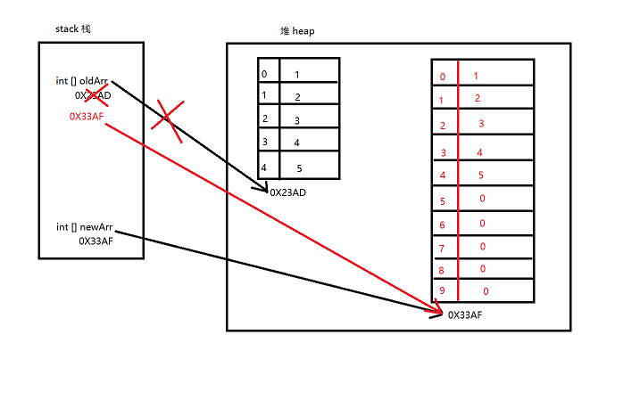
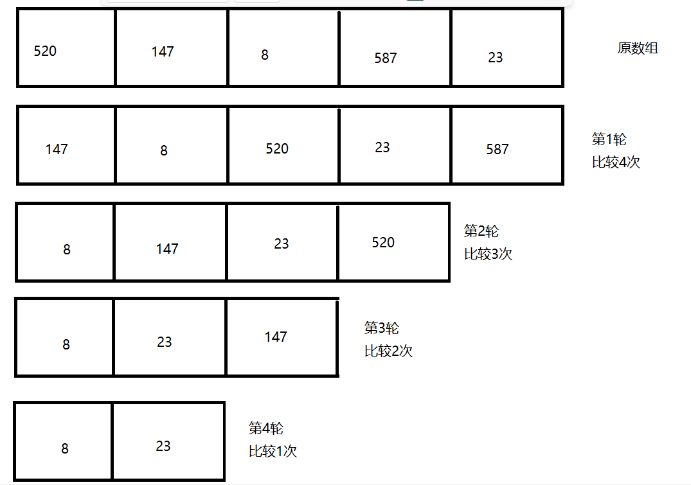
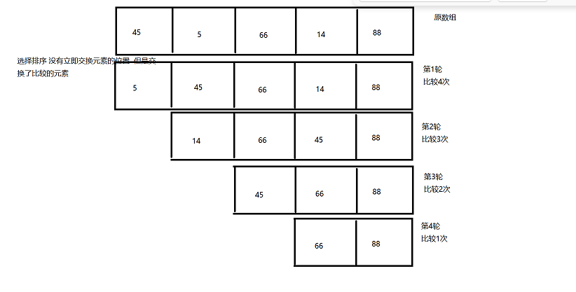

## 数组

### 1.数组的概念

> 概念：一组`连续`的存储空间，存储多个`相同`数据类型的值，长度是`固定`的。

### 2. 数组的定义

> 先声明、再分配空间：
> 数据类型[] 数组名;
> 数组名 = new 数据类型[长度];
>
> 声明并分配空间：
> 数据类型[] 数组名 = new 数据类型[长度];
>
> 声明并赋值（繁）：
> 数据类型[] 数组名 = new 数据类型[]{value1,value2,value3,...};
>
> 声明并赋值（简）：
> 数据类型[] 数组名 = {value1,value2,value3,...}; 

```java
package com.atguigu.test2;

/**
 * @author WHD
 * @description TODO
 * @date 2023/8/2 10:37
 *  数组的定义：四种方式
 *  小细节：声明数组的中括号通常写在类型之后 数组名之前 也可以写在 数组名之后
 */
public class TestArrayDefine {
    public static void main(String args []) {
        // 方式1 先声明 再开辟空间
        int [] arr1;
        arr1 = new int[3];

        // 方式2 声明并且开辟空间
        int [] arr2  = new int[5];

        // 方式3 声明并且赋值 (繁琐)
        int [] arr3 = new int[]{1,3,5,8,9,6,55,22};

        // 方式4 声明并且赋值 简单
        int [] arr4 = {89,55,666,999,120,352};
    }
}
```

### 3. 数组的使用

> 数组的元素：数组中的每个数据称之为数组中的元素
>
>
> 数组的访问：对数组中的元素赋值以及取值的操作 统称为数组的访问
>
>
> 下标、索引、角标、index ： 下标自动生成 从0开始 往后依次+1
>
>
> 访问数组通过下标访问：
>
> 赋值  数组名[下标] = 值;
>
> 取值  System.out.println(数组名[下标]);
>
>
> 访问不存在的下标 将会导致数组下标越界异常  ArrayIndexOutOfBoundsException

```java
package com.atguigu.test3;

import java.util.Scanner;

/**
 * @author WHD
 * @description TODO
 * @date 2023/8/2 11:01
 *  数组的元素：数组中的每个数据称之为数组中的元素
 *
 *  数组的访问：对数组中的元素赋值以及取值的操作 统称为数组的访问
 *
 *  下标、索引、角标、index ： 下标自动生成 从0开始 往后依次+1
 *
 *  访问数组通过下标访问：
 *      赋值  数组名[下标] = 值;
 *      取值  System.out.println(数组名[下标]);
 *
 *  访问不存在的下标 将会导致数组下标越界异常  ArrayIndexOutOfBoundsException
 *
 * ctrl + d 赋值当前行
 */
public class TestArrayUse {

    public static void main(String[] args) {
        int [] arr1 = new int[5];
        // 赋值
        arr1[0] = 11;
        arr1[1] = 132;
        arr1[2] = 321;
        arr1[3] = 444;
        arr1[4] = 666;
//        arr1[213231] = 888;

        // 取值
        System.out.println(arr1[0]);
        System.out.println(arr1[1]);
        System.out.println(arr1[2]);
        System.out.println(arr1[3]);
        System.out.println(arr1[4]);
//        System.out.println(arr1[5]);


    }

}
```

### 4. 数组的遍历

> 数组的遍历：逐一对数组中的元素进行访问 称之为数组的遍历

```java
package com.atguigu.test3;

import java.util.Scanner;

/**
 * @author WHD
 * @description TODO
 * @date 2023/8/2 11:13
 *  数组的遍历：逐一对数组中的元素进行访问 称之为数组的遍历
 */
public class TestArrayForeach {
    public static void main(String[] args) {
        int [] nums = new int[5];

        // 使用for循环给数组元素赋值
        Scanner input = new Scanner(System.in);

        for(int i = 0;i < 5;i++){
            System.out.println("请输入第" + (i + 1) + "个元素的值");
            nums[i] = input.nextInt();
        }

        System.out.println("---------------------------------------------------");

        // 使用for循环获取数组的元素
        for(int i = 0;i < 5;i++){
            System.out.println("第" + (i + 1) + "个元素的值为" + nums[i]);
        }

        System.out.println("程序结束");


    }
}

```


### 5.数组的属性

> 数组的属性：length属性 表示数组的长度 是一个int类型的整数 可以通过数组名.length获取

```java
package com.atguigu.test3;

/**
 * @author WHD
 * @description TODO
 * @date 2023/8/2 11:17
 *  数组的属性：length属性 表示数组的长度 是一个int类型的整数 可以通过数组名.length获取
 */
public class TestArrayField {
    public static void main(String[] args) {
        int [] arr1 = {454,8,2,655,54};

        System.out.println(arr1.length);

        for(int i = 0;i < arr1.length;i++){
            System.out.println(arr1[i]);
        }

    }
}

```


### 6.数组的默认值

> 数组的默认值：数组作为引用数据类型 其元素是有默认值的 当我们给数组开辟空间以后 默认值即存在
>
> 整数：0
>
> 浮点：0.0
>
> 字符：\u0000
>
> 布尔：false
>
> 其他：null (空)
>
>
> JDK提供了一个用于操作数组的工具类 java.util.Arrays
>
> 此类中提供大量的用于操作数组的各种方法
>
> Arrays.toString(数组名) : 将数组中的元素转换为字符串 返回

```java
package com.atguigu.test3;

import java.util.Arrays;

/**
 * @author WHD
 * @description TODO
 * @date 2023/8/2 11:22
 *  数组的默认值：数组作为引用数据类型 其元素是有默认值的 当我们给数组开辟空间以后 默认值即存在
 *  整数：0
 *  浮点：0.0
 *  字符：\u0000
 *  布尔：false
 *  其他：null (空)
 *
 *  JDK提供了一个用于操作数组的工具类 java.util.Arrays
 *  此类中提供大量的用于操作数组的各种方法
 *  Arrays.toString(数组名) : 将数组中的元素转换为字符串 返回
 *
 */
public class TestArrayDefaultValue {
    public static void main(String[] args) {
        byte [] arr1 = new byte[3];
        String str = Arrays.toString(arr1);
        System.out.println("str = " + str);

        short [] arr2 = new short[4];
        System.out.println(Arrays.toString(arr2));

        int [] arr3 = new int[5];
        System.out.println(Arrays.toString(arr3));

        long [] arr4 = new long[6];
        System.out.println(Arrays.toString(arr4));

        System.out.println("----------------------------------------------");

        float [] arr5 = new float[3];
        System.out.println(Arrays.toString(arr5));

        double [] arr6 = new double[4];
        System.out.println(Arrays.toString(arr6));

        System.out.println("----------------------------------------------");

        boolean [] arr7 = new boolean[5];
        System.out.println(Arrays.toString(arr7));

        System.out.println("----------------------------------------------");
        char [] arr8 = new char[4];

        System.out.println(Arrays.toString(arr8));

        System.out.println("----------------------------------------------");

        // 关于null值 以及 空指针异常  NullPointerException
        // 使用一个为null的对象 调用任何的属性 或者 方法 都将出现空指针异常
        String [] arr9 = new String[2];

        System.out.println(Arrays.toString(arr9));


    }
}

```


### 7.数组的扩容

> 数组的扩容：
>
> 实现步骤：
>
> ​	1.创建比原数组更长的新数组
>
> ​	2.将原数组中的元素依次复制到新数组中
>
> ​	3.将新数组的地址赋值给原数组
>
>
>
> 数组作为引用数据类型 其数组名中保存的是指向堆中的地址
>  所以 当我们把一个数组 赋值 给 另外一个数组   `赋值的是地址`




```java
package com.atguigu.test4;


import java.util.Arrays;

/**
 * @author WHD
 * @description TODO
 * @date 2023/8/2 13:59
 *  数组的扩容：
 *  实现步骤：
 *      1.创建比原数组更长的新数组
 *      2.将原数组中的元素依次复制到新数组中
 *      3.将新数组的地址赋值给原数组
 */
public class TestArrayGrow {
    public static void main(String[] args) {
        int [] oldArr = {1,2,3,4,5};

        int [] newArr = new int[oldArr.length * 2];

        for(int i = 0;i < oldArr.length ;i++){
            newArr[i] = oldArr[i];
        }

        System.out.println(Arrays.toString(newArr));
        // 数组作为引用数据类型 其数组名中保存的是指向堆中的地址
        // 所以 当我们把一个数组 赋值 给 另外一个数组
        // 赋值的是地址

        System.out.println(oldArr);
        System.out.println(newArr);

        oldArr = newArr;
        System.out.println("==================地址赋值以后===================");

        System.out.println(oldArr);
        System.out.println(newArr);

        System.out.println(oldArr.length);

        System.out.println(Arrays.toString(oldArr));

        System.out.println("------------------------------------------------------------------");

        newArr[9] = 666;

        System.out.println(oldArr[9]); // 0? 666?
    }
}

```

### 8.数组的复制

> 复制数组的三种方式：
>
> ​	循环将原数组中所有元素逐一赋值给新数组。
>
> ​	System.arraycopy(原数组,原数组起始,新数组,新数组起始,长度);
>
> ​	java.util.Arrays.copyOf(原数组, 新长度);//返回带有原值的新数组。

```java
package com.atguigu.test4;

import java.sql.SQLOutput;
import java.util.Arrays;

/**
 * @author WHD
 * @description TODO
 * @date 2023/8/2 14:23
 *  复制数组的三种方式：
 *      循环将原数组中所有元素逐一赋值给新数组。
 *      System.arraycopy(原数组,原数组起始,新数组,新数组起始,长度);
 *      java.util.Arrays.copyOf(原数组, 新长度);//返回带有原值的新数组。
 */
public class TestArrayCopy {
    public static void main(String[] args) {
        int [] oldArr = {1,2,3,4,5};

        int [] newArr = new int[10];

        System.arraycopy(oldArr, 1, newArr, 2, 2);

        System.out.println(Arrays.toString(newArr));

        System.out.println("-------------------------------------------------");

        int [] nums = {11,22,33,44,55};

        // 第一个参数 原数组
        // 第二个参数 新长度 新长度可以小于等于或者大于原数组的长度
        int [] newNums = Arrays.copyOf(nums, 5);

        System.out.println(Arrays.toString(newNums));
    }
}
```

### 9. 课堂练习

> 数组课堂练习1： 统计int类型数组中所有元素的总和，平均值。

```java
package com.atguigu.test5;

import java.util.Scanner;

/**
 * @author WHD
 * @description TODO
 * @date 2023/8/2 15:12
 *  数组课堂练习1： 统计int类型数组中所有元素的总和，平均值。
 */
public class TestArrayExercise1 {
    public static void main(String[] args) {
        Scanner input = new Scanner(System.in);
        System.out.println("请输入数组的长度");
        int length = input.nextInt();
        int [] nums = new int[length];
        int sum = 0;
        for(int i =0;i < nums.length;i++){
            System.out.println("请输入第" + (i + 1) + "个元素的值");
            nums[i] = input.nextInt();

            sum += nums[i];
        }

        System.out.println("数组的元素总和为：" + sum);
        System.out.println("数组的平均值为：" + sum / nums.length);

    }
}

```

> 数组课堂练习2：求一个数组中的最大值，或者最小值。
>
> 分析：先假设一个最大值/最小值 依次与其他元素进行比较 如果遇到更大的/更小的 就交换
>
> 头衔

```java
package com.atguigu.test5;

/**
 * @author WHD
 * @description TODO
 * @date 2023/8/2 15:16
 *  数组课堂练习2：求一个数组中的最大值，或者最小值。
 *  分析：先假设一个最大值/最小值 依次与其他元素进行比较 如果遇到更大的/更小的 就交换
 *  头衔
 */
public class TestArrayExercise2 {
    public static void main(String[] args) {
        int [] nums = {562,999,458,896,36985,210,254,785,3,6,5,2};

        int max = nums[0]; // 假设第一个元素为最大元素

        int min = nums[0]; // 假设第一个元素为最小元素

        // 逐一跟后续的元素进行比较
        // 因为我们假设的元素下标为0  所以比较元素下标从1 开始 因为 不需要自己跟自己比了
        for(int i = 1;i < nums.length;i++){
            if(max < nums[i]){ // 如果遇到了更大的元素 则交换'最大元素' 头衔
                max = nums[i]; // 交换
            }
            if(min > nums[i]){// 如果遇到了更小的元素 则交换'最小元素' 头衔
                min = nums[i]; // 交换
            }

        }
        System.out.println("最大的元素为：" + max);
        System.out.println("最小的元素为：" + min);

    }
}

```

### 10. 面试题

>  值传递和引用传递的区别？
>
> Java官方明确指出 Java中只有值传递
>
> 基本数据类型属于'值传递',传递的就是值的副本，值的拷贝,在方法中对参数的修改不会影响原变量
>
> 引用数据类型属于'引用传递' 传递的是地址，也就是引用,在方法中对参数的修改会影响原变量
>
> String类型是特殊的引用数据类型 作为参数不会影响原变量 因为String是不可变 

```java
package com.atguigu.test6;

import java.util.Arrays;

/**
 * @author WHD
 * @description TODO
 * @date 2023/8/2 15:36
 *  值传递和引用传递的区别？
 *  Java官方明确指出 Java中只有值传递
 *  基本数据类型属于'值传递',传递的就是值的副本，值的拷贝,在方法中对参数的修改不会影响原变量
 *  引用数据类型属于'引用传递' 传递的是地址，也就是引用,在方法中对参数的修改会影响原变量
 *  String类型是特殊的引用数据类型 作为参数不会影响原变量 因为String是不可变 
 */
public class TestArrayInterView {
    public static void m1(int num){
        num++;
    }
    public static void m2(int [] nums){
        System.out.println("nums = " + nums);
        for (int i = 0; i < nums.length; i++) {
            nums[i]++;
        }
    }
    public static void main(String[] args) {
        int a = 10;
        m1(a);
        System.out.println("a = " + a); // 10

        int [] b = {1,2,3,4,5};
        m2(b);
        System.out.println("b = " + b);
        System.out.println(Arrays.toString(b)); // 2,3,4,5,6
    }


}

```

### 11.可变长参数

> 可变长参数：可接收多个同类型实参，个数不限，使用方式与数组相同。
>
> 要求：
>
> 1.整个形参列表中只能有一个可变长参数
>
> 2.必须书写在形参列表的末尾
>
> 格式：数据类型...参数名

```java
package com.atguigu.test6;

/**
 * @author WHD
 * @description TODO
 * @date 2023/8/2 15:54
 *  可变长参数：可接收多个同类型实参，个数不限，使用方式与数组相同。
 *  要求：
 *      1.整个形参列表中只能有一个可变长参数
 *      2.必须书写在形参列表的末尾
 *  格式：数据类型...参数名
 */
public class TestChangedParam {
    public static void m1(int ... args){
        System.out.println("m1方法开始执行");
        for(int i =0;i < args.length;i++){
            System.out.println(args[i]);
        }
        System.out.println("m1方法执行完毕");
    }
    public static void m2(int [] args){
        System.out.println("m2方法开始执行");
        for(int i =0;i < args.length;i++){
            System.out.println(args[i]);
        }
        System.out.println("m2方法执行完毕");
    }
    public static void main(String[] args) {
        m1(1,2,3,4,5,6);

        int [] nums = new int[4];
        m2(nums);

    }


}

```

### 12. 冒泡排序





```java
package com.atguigu.test1;

import java.util.Arrays;

/**
 * @author WHD
 * @description TODO
 * @date 2023/8/4 9:16
 *  冒泡排序：相邻的两个元素比较大小 条件成立 则交换位置 直到数列排列正确
 *
 *  比较的轮数为：n - 1
 *  每一轮比较的次数：n - 1 - ?
 *
 *  外层循环控制比较的轮数：n - 1
 *  内存循环控制每一轮比较的次数：n - 1 - i
 *
 */
public class TestBubbleSort {
    public static void main(String[] args) {
        int [] nums = {562,451,110,23,45,85,96,666};
        for(int i = 0;i < nums.length - 1;i++){ // 行数 即 轮数
            for(int j = 0;j < nums.length - 1 - i;j++){// 列数 即 比较的次数
                if(nums[j] < nums[j + 1]){
                    // 交换元素写法固定规律：上一行的等号右边的值 在下一行 直接写在等号左边 等待被覆盖
                    int temp = nums[j];
                    nums[j] = nums[j + 1];
                    nums[j + 1] = temp;
                }
            }
            System.out.println("第" + (i + 1) + "轮比较完成以后顺序为：" + Arrays.toString(nums)+ "---------------------");
        }
        System.out.println(Arrays.toString(nums));
    }
}

```

### 13.选择排序




```java
package test2;

import java.util.Arrays;

/**
 * @author WHD
 * @description TODO
 * @date 2023/8/4 10:14
 *
 *
 *  选择排序：固定位置的元素与其他元素依次比较大小，遇到需要交换位置的元素，先不交换，
 *  使用应该被交换位置的元素继续往后比较，等待一轮比较完成，统一交换一次位置。
 *
 *  选择排序比较的轮数依然为： n - 1
 *  每一轮比较的次数：最多的一次为n - 1 后续每一轮递减1
 *
 *  分析：
 *      将外层循环作为比较的元素A 从第一个元素开始 到倒数第二个元素
 *      将内层循环作为比较的元素B 从第二个元素开始 到最后一个元素 (即每一轮都是从比较的元素A 紧邻的后边的位置开始)
 *
 *  选择排序每一轮最多只会交换一次位置 所以即使每一轮都交换位置 也最多交换长度-1次 因为轮数为长度-1轮
 */
public class TestChoiceSort {
    public static void main(String[] args) {
        int [] nums = {-2,562,-1,451,110,23,45,85,96,666};

        int count = 0;

        for(int i = 0;i < nums.length -1;i++){ // A
            int moveIndex = i; // 定义moveIndex 表示为需要最终交换位置的下标
            for(int j = i + 1; j < nums.length;j++){ // B
                if(nums[moveIndex] < nums[j]){
                    moveIndex = j;
                }
            }
            // 如果moveIndex 和 i的值不相同 则表示需要交换元素
            // 因为 只有比较大小的条件成立 moveIndex的值 才会发生变化
            // 而条件成立 则表示有需要交换位置的元素
            // 最终将moveIndex 和 i 对应位置的元素进行交换 因为
            // i 表示每一轮的第一个元素 而moveIndex最终将停留在最大/最小的元素
            if(moveIndex != i){
                int temp = nums[i];
                nums[i] = nums[moveIndex];
                nums[moveIndex] = temp;
                count++;
            }
        }

        System.out.println(Arrays.toString(nums));
        System.out.println("一共交换了" + count + "次位置");
    }
}
```

### 14. Arrays工具类

> java.util.Arrays 是JDK提供的一个用于操作数组的工具类  
>
> toString(数组名) : 将数组中的元素转换为字符串
>
> copyOf(数组名,新长度) : 复制数组
>
> sort(数组名) : 将数组按照升序排序  属于快速排序 实现原理为 递归 
>
> fill(数组名,填充元素) : 将数组按照指定元素进行填充
>
> binarySearch(数组名,元素) : 使用二分查找法查找某个元素在数组中的下标

```java
package com.atguigu.test3;

import java.util.Arrays;

/**
 * @author WHD
 * @description TODO
 * @date 2023/8/4 14:05
 *  toString(数组名) : 将数组中的元素转换为字符串
 *  copyOf(数组名,新长度) : 复制数组
 *  sort(数组名) : 将数组按照升序排序
 *  fill(数组名,填充元素) : 将数组按照指定元素进行填充
 *  binarySearch(数组名,元素) : 使用二分查找法查找某个元素在数组中的下标
 */
public class TestArrays {
    public static void main(String[] args) {
        int [] nums = {56,12,22,41,85,99};

        Arrays.sort(nums);

        System.out.println(Arrays.toString(nums));

        int [] newArr = new int[nums.length];

        for(int i = 0,j = nums.length -1;i < nums.length;i++,j--){
            newArr[i] = nums[j];
        }

        System.out.println(Arrays.toString(newArr));

        System.out.println("--------------------------------------------");

        Arrays.fill(newArr, 666);

        System.out.println(Arrays.toString(newArr));

        System.out.println("--------------------------------------------");

        int index = Arrays.binarySearch(nums, 999);

        System.out.println("index = " + index);

    }
}

```

### 15. 数组插入元素

> 编写方法实现在数组中插入元素
>
> 扩展：可以使用System.arraycopy方法 实现插入效果

```java
package com.atguigu.test3;

import java.util.Arrays;

/**
 * @author WHD
 * @description TODO
 * @date 2023/8/4 14:16
 *  编写方法实现在数组中插入元素
 *  扩展：可以使用System.arraycopy方法 实现插入效果
 */
public class TestArrayInsert {
    public static void main(String[] args) {
        int [] nums = {1,2,3,4,5};
        int[] newArray = insert(nums, -8, 666);
        System.out.println(Arrays.toString(newArray));
    }
    /**
     *
     * @param oldArray 操作的数据
     * @param index 插入元素的位置
     * @param num 插入的元素
     * @return 新的数组
     */
    public static int[] insert(int [] oldArray,int index,int num){
        // 下标不能小于0 或者 不能大于数组的长度
        if(index < 0 || index > oldArray.length){
            System.out.println("下标不合法");
            // 如果下标不合法 则将传入的数组 直接返回 表示没有做任何操作
            return oldArray;
        }

        // 代码执行到这里 表示下标没问题
        // 准备一个长度+1的数组 用于插入元素
        int [] newArray = new  int[oldArray.length + 1];

        // 遍历开始移动元素
        for(int i = 0;i < oldArray.length;i++){
            // 情况1 小于插入下标 则直接复制到新数组中
            if(i < index){
                newArray[i] = oldArray[i];
            }else{ // 情况2  大于或者等于插入下标 则移动到新数组的+1位置
                newArray[i + 1] = oldArray[i];
            }
        }
        // 空缺位插入指定的元素
        newArray[index] = num;
        return newArray; // 将新数组返回
    }
}

```

### 16.数组删除元素

> 编写方法实现删除数组中的元素
>
> 扩展：可以使用System.arraycopy方法 实现删除效果

````java
package com.atguigu.test3;

import java.util.Arrays;

/**
 * @author WHD
 * @description TODO
 * @date 2023/8/4 14:31
 *  编写方法实现删除数组中的元素
 *  扩展：可以使用System.arraycopy方法 实现删除效果
 */
public class TestArrayDelete {
    public static int[] delete(int [] oldArray,int index){
        // 判断下标 如果小于0 或者 大于等于数组长度 表示不合法 因为删除 只能删除有效范围以内的
        if(index < 0 || index >= oldArray.length){
            System.out.println("下标不合法");
            return oldArray; // 直接将传入的原数组返回 表示没有做任何操作
        }

        // 准备一个长度-1的数组 用于删除之后复制元素
        int [] newArray = new int[oldArray.length - 1];
        // 循环遍历开始复制元素
        for(int i = 0;i < newArray.length;i++){
            if(i < index){ // 情况1 小于删除的下标 直接复制
                newArray[i] = oldArray[i];
            }else{ // 情况2 大于等于删除下标 则直接将原数组的+1位置 移动到新数组的后续位置 属于向左移动覆盖
                newArray[i] = oldArray[i +1];
            }
        }
        return newArray; // 将新数组返回
    }

    public static void main(String[] args) {
        int [] nums = {1,2,3,4,5};
        int[] delete = delete(nums, -5);
        System.out.println(Arrays.toString(delete));
    }

}
````

### 17.二维数组

> 二维数组：数组中的元素还是数组

```java
package com.atguigu.test3;

/**
 * @author WHD
 * @description TODO
 * @date 2023/8/4 15:30
 *  二维数组：数组中的元素还是数组
 */
public class Test2DArray {
    public static void main(String[] args) {
        int [] arr1 = {1,2,3,4,5};
        int [] [] arr2 = { {1,2,4} ,  {55,88,66}  , {666} , {999,888,777}};

        System.out.println(arr2[0]);
        System.out.println(arr2[0][0]);
        System.out.println(arr2[0][1]);
        System.out.println(arr2[0][2]);
        System.out.println("----------------------------------");
        System.out.println(arr2[1][0]);
        System.out.println(arr2[1][1]);
        System.out.println(arr2[1][2]);
        System.out.println("----------------------------------");
        System.out.println(arr2[2][0]);
        System.out.println("----------------------------------");
        System.out.println(arr2[3][0]);
        System.out.println(arr2[3][1]);
        System.out.println(arr2[3][2]);

        System.out.println("----------------------------------");

        for(int i = 0;i < arr2.length;i++){
            System.out.println(arr2[i]);
            for(int j = 0;j < arr2[i].length;j++){
                System.out.print(arr2[i][j] + "\t");
            }
            System.out.println();
        }


    }
}

```


> 二维数组定义：和一维数组定义方式大致相同
>
> 二维开辟空间 高维度(第一个中括号)长度必须指定 低维度(第二个中括号)长度可以后续单独指定

```java
package com.atguigu.test3;

/**
 * @author WHD
 * @description TODO
 * @date 2023/8/4 15:38
 *  二维数组定义：和一维数组定义方式大致相同
 *  二维开辟空间 高维度(第一个中括号)长度必须指定 低维度(第二个中括号)长度可以后续单独指定
 */
public class Test2DArrayDefine {
    public static void main(String[] args) {
        // 方式1
        int [][] arr1;
        arr1 = new int[3][4];

        // 方式2
        // 数组的默认值 二维数组每个元素为一维数组 属于引用数据类型 其默认值为null
        // 当我们创建一个长度为2的二维数组 表示在内存中 有两个一维数组 都指向为null
        int [][] arr2 = new int[2][];

        System.out.println(arr2[0]);
        System.out.println(arr2[1]);


        arr2[0] = new int[3];
        arr2[0][0] = 11;
        arr2[0][1] = 11;
        arr2[0][2] = 11;

        arr2[1] = new int[2];
        arr2[1][0] = 34;
        arr2[1][1] = 56;


        // 方式3
        int [][] arr3 = new int[][]{{1},{22,33,44},{55,55,666}};

        // 方式4
        int [][] arr4 = {{1},{22,33,44},{55,55,666}};


    }
}

```

> 二维数组实现：杨辉三角

```java
package com.atguigu.test3;

/**
 * @author WHD
 * @description TODO
 * @date 2023/8/4 15:47
 *  杨辉三角
 *  1
 *  1   1
 *  1   2   1
 *  1   3   3   1
 *  1   4   6   4   1
 *  1   5   10  10  5   1
 */
public class TestYangHuiTriangle {
    public static void main(String[] args) {
        int [][] yh = new int[6][6];
        for(int i = 0;i < yh.length;i++){
            yh[i][0] = 1; // 每一行的第一列为1
            yh[i][i] = 1;

            if(i > 1){ // 表示从第3行开始 赋值有具体的计算
                for(int j = 1;j < i;j++){ // 因为每一行的第一列 和 最后一列都有值了 为0  所以 我们只需要赋值中间的元素
                    yh[i][j] = yh[i -1][j] + yh[i -1][j -1];
                }
            }
        }
        for(int i = 0;i < yh.length;i++){
            for(int j = 6;j >= i;j--){
                System.out.print(" ");
            }
            for(int j = 0;j <= i;j++){
                System.out.print(yh[i][j] + " ");
            }
            System.out.println();
        }
    }
}

```


