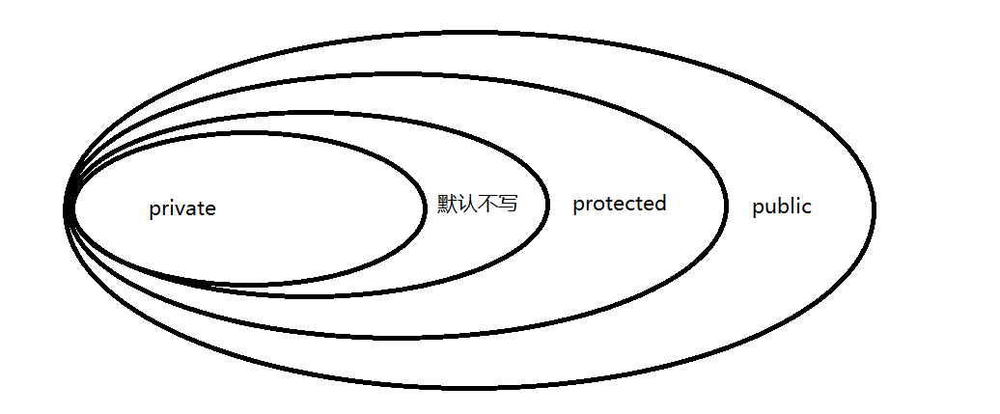

##  封装和继承

### 1. 封装

> 封装：属性私有  方法公开
>
> 属性私有：将类中的属性都使用private修饰 表示此属性只能在本类中访问 其他类无法访问
>
> 方法公开：针对每个属性都编写一对公开的方法 分别用于属性的赋值setter 和 取值getter
>
>
> 方法书写格式：
>
> 赋值的方法统一以set开头 加上属性名称 属性名首字母大写
>
> 取值的方法统一以get开头 加上属性名称 属性名首字母大写
>
>
> 高内聚： 本类中的属性和方法应该直接与本类对象，事物产生关联， 不应该间接关联 或者 没有关联
>
> 低耦合：耦合度表示紧密连接程度 降低耦合度即表示 降低紧密连接程度  提高程序的可扩展性 灵活性

```java
package com.atguigu.test1;

/**
 * @author WHD
 * @description TODO
 * @date 2023/8/7 9:16
 *  企鹅类
 *  属性： 名字 性别  健康值
 *
 *  封装：属性私有  方法公开
 *  属性私有：将类中的属性都使用private修饰 表示此属性只能在本类中访问 其他类无法访问
 *  方法公开：针对每个属性都编写一对公开的方法 分别用于属性的赋值setter 和 取值getter
 *
 *  方法书写格式：
 *      赋值的方法统一以set开头 加上属性名称 属性名首字母大写
 *      取值的方法统一以get开头 加上属性名称 属性名首字母大写
 *
 *  高内聚： 本类中的属性和方法应该直接与本类对象，事物产生关联， 不应该间接关联 或者 没有关联
 *  低耦合：耦合度表示紧密连接程度 降低耦合度即表示 降低紧密连接程度  提高程序的可扩展性 灵活性
 */
public class Penguin {
    private String name;
    public void  setName(String name){
        this.name = name;
    }
    public String getName(){
        return name;
    }
    private char sex;
    public void setSex(char sex){
        if(sex == '雌' || sex == '雄'){
            this.sex = sex;
        }else{
            System.out.println("属性赋值不合理，将使用默认性别：雄");
            this.sex = '雄';
        }
    }
    public char getSex(){
        return sex;
    }
    private int health;
    public void setHealth(int health){
        if(health > 0 && health <= 100){
            this.health = health;
        }else{
            System.out.println("属性赋值不合理，将使用默认健康值：60");
            this.health = 60;
        }
    }
    public int getHealth(){
        return health;
    }

}


```

```java
package com.atguigu.test1;

/**
 * @author WHD
 * @description TODO
 * @date 2023/8/7 9:30
 */
public class TestPenguin {
    public static void main(String[] args) {
        Penguin p = new Penguin();
        // 赋值 我们使用set方法来替代
        p.setName("小白");
        p.setHealth(-888);
        p.setSex('男');
//        p.name      =       "大白";
//        p.sex = '男';
//        p.health = -999;

        System.out.println("---------------------------------------------");

        // 取值 我们使用get方法来替代
//        System.out.println(p.name);
//        System.out.println(p.sex);
//        System.out.println(p.health);
        System.out.println(p.getName());
        System.out.println(p.getSex());
        System.out.println(p.getHealth());

    }
}

```

### 2.封装的好处

> 便于使用者正确使用系统，防止错误修改属性
>
> 降低了构建大型系统的风险
>
> 提高程序的可重用性
>
> 降低程序之间的耦合度

### 3.访问权限修饰符



> 类的访问修饰符
> ​	public修饰符：公有访问级别
> ​	默认修饰符：包级私有访问级别

> 类成员：类中的属性、方法、构造方法
>
> 类成员的访问权限修饰符：private 默认不写 protected public

> 如果在一个方法中使用两个同名不包的类，可以使用全限定名加以区分。

```java
package com.atguigu.test5;

import com.atguigu.test3.D;

/**
 * @author WHD
 * @description TODO
 * @date 2023/8/7 11:08
 */
public class TestD {
    public static void main(String[] args) {
        D d1 = new D();
        d1.m1();

        // 包名 +  类名 称之为：全限定名
        com.atguigu.test4.D d2 = new com.atguigu.test4.D();
        d2.m1();

    }
}
```


### 4. super关键字

> super用于访问父类的信息(属性、方法、构造方法)
>
> 前提：必须在访问权限允许的情况下

#### 4.1 super访问父类的属性

> 属性：super.属性名
>
> 如果在同包中的父子类，那么属性如果需要被子类访问，属性的访问权限最起码是默认修饰符修饰的，如果是不再同包的父类，属性的访问权限最起码是protected修饰的

```java
package com.atguigu.test7;

/**
 * @author WHD
 * @description TODO
 * @date 2023/8/7 14:18
 *  宠物父类：
 *  父类中书写各个子类共有的属性 和 方法
 *  子类中书写独有的属性 和 方法
 */
public class Pet {
    protected String name;
    protected int health;
    protected int love;

    public String getName() {
        return name;
    }
    public void setName(String name) {
        this.name = name;
    }
    public int getHealth() {
        return health;
    }
    public void setHealth(int health) {
        this.health = health;
    }
    public int getLove() {
        return love;
    }
    public void setLove(int love) {
        this.love = love;
    }

    public Pet(){}


    public void print(){
        System.out.println("宠物的名字是：" + name);
        System.out.println("宠物的健康值是：" + health);
        System.out.println("宠物的亲密值是：" + love);
    }

}

```

```java
package com.atguigu.test7;

/**
 * @author WHD
 * @description TODO
 * @date 2023/8/7 14:13
 *  狗狗类：
 *      名字 健康值 亲密值 品种
 *      打印狗狗信息
 *      无参构造
 */
public class Dog extends Pet {
    private String strain;
    public String getStrain() {
        return strain;
    }
    public void setStrain(String strain) {
        this.strain = strain;
    }
    public Dog() {
    }

    public Dog(String name,int health,int love,String strain){
        super.name = name;
        super.health = health;
        super.love = love;
        this.strain = strain;
    }

}

```

```java
package com.atguigu.test8;

import com.atguigu.test7.Pet;

/**
 * @author WHD
 * @description TODO
 * @date 2023/8/7 15:18
 *  猫咪类：
 *      毛发颜色
 */
public class Cat extends Pet {
    private String furColor;

    public String getFurColor() {
        return furColor;
    }

    public void setFurColor(String furColor) {
        this.furColor = furColor;
    }
    public Cat(){}

    public Cat(String name,int health,int love,String furColor){
        super.name = name;
        super.health = health;
        super.love = love;
        this.furColor = furColor;
    }

    public void printCat(){
        System.out.println("猫咪的毛发颜色为：" + furColor);
        print();
    }


}

```


#### 4.2 super访问父类的方法

> 方法：super.方法名   继承自父类的方法 可以通过this加点访问  也可以通过super加点访问 也可以直接访问

```java
package com.atguigu.test7;

/**
 * @author WHD
 * @description TODO
 * @date 2023/8/7 14:18
 *  宠物父类：
 *  父类中书写各个子类共有的属性 和 方法
 *  子类中书写独有的属性 和 方法
 */
public class Pet {
    protected String name;
    protected int health;
    protected int love;

    public String getName() {
        return name;
    }
    public void setName(String name) {
        this.name = name;
    }
    public int getHealth() {
        return health;
    }
    public void setHealth(int health) {
        this.health = health;
    }
    public int getLove() {
        return love;
    }
    public void setLove(int love) {
        this.love = love;
    }


    public void print(){
        System.out.println("宠物的名字是：" + name);
        System.out.println("宠物的健康值是：" + health);
        System.out.println("宠物的亲密值是：" + love);
    }

}

```

```java
package com.atguigu.test7;

/**
 * @author WHD
 * @description TODO
 * @date 2023/8/7 14:13
 *  狗狗类：
 *      名字 健康值 亲密值 品种
 *      打印狗狗信息
 *      无参构造
 */
public class Dog extends Pet {
    private String strain;
    public String getStrain() {
        return strain;
    }
    public void setStrain(String strain) {
        this.strain = strain;
    }
    public Dog() {
    }


    public void printDog(){
        System.out.println("狗狗的品种是：" + strain);
        super.print(); // this.print();  print();
    }
}
```

#### 4.3 super访问父类的构造方法

> 构造方法:super() 必须在子类构造方法中的第一句

> 关于子类访问父类的构造方法：
>
> 子类的每一个构造方法中 都默认访问(调用)父类的无参构造方法
>
> 除非在子类构造方法访问了父类的有参构造方法 则不再访问父类的无参构造
>
> 总结：子类构造方法中必须访问父类的无参构造 或者 有参构造方法 其中任意一种  必须2选1 不能选0 也不能选2

```java
package com.atguigu.test9;

/**
 * @author WHD
 * @description TODO
 * @date 2023/8/7 14:18
 *  宠物父类：
 *  父类中书写各个子类共有的属性 和 方法
 *  子类中书写独有的属性 和 方法
 */
public class Pet {
    protected String name;
    protected int health;
    protected int love;

    public String getName() {
        return name;
    }
    public void setName(String name) {
        this.name = name;
    }
    public int getHealth() {
        return health;
    }
    public void setHealth(int health) {
        this.health = health;
    }
    public int getLove() {
        return love;
    }
    public void setLove(int love) {
        this.love = love;
    }


    public Pet(String name,int health,int love){
        this.name = name;
        this.health = health;
        this.love = love;
    }

    public Pet() {
    }


}

```

```java
package com.atguigu.test9;

/**
 * @author WHD
 * @description TODO
 * @date 2023/8/7 14:13
 *  狗狗类：
 *      名字 健康值 亲密值 品种
 *      打印狗狗信息
 *      无参构造
 */
public class Dog extends Pet {
    private String strain;
    public String getStrain() {
        return strain;
    }
    public void setStrain(String strain) {
        this.strain = strain;
    }
    public Dog() {
        System.out.println("Dog类无参构造方法执行了");
    }
    public Dog(String name,int health,int love,String strain){
        super(name, health, love);
        this.strain = strain;
    }
}
```

### 5. this和super关键字区别

> this表示当前对象
>
> super表示用于访问当前对象中父类的信息 是包含在this对象之内的 

> 能不能同时在一个构造方法中使用this以及super访问本类以及父类的构造方法？
>
> 不能，同时访问本类以及父类的构造，但是同时访问其他的属性或者 方法 是可以的

### 6.子类可以继承哪些内容

> 继承public和protected修饰的属性和方法，不管子类和父类是否在同一个包里
>
> 继承默认权限修饰符修饰的属性和方法，但子类和父类必须在同一个包里
>
> `子类可以继承父类访问权限允许的属性和方法`

### 7. 子类不能继承哪些内容

> private修饰的属性和方法不能被继承
>
> 子类与父类不在同包，使用默认访问权限的成员
>
> 构造方法

### 8. 继承

> 子类继承父类 子类与父类是is-a的关系 表示只有子类属于父类这种关系 才可以使用继承设计
>
> 父类中书写各个子类共有的属性和方法
>
> 子类中书写独有的属性和方法
>
> Java中只支持单根继承，即一个子类只能有一个直接父类，间接父类没有限制
>
> 继承是实现代码重用的重要手段之一

### 9. 关于this和super访问信息


> 子类继承自父类的属性，可以使用super访问，也可以使用this访问，也可以直接访问，如果子类中有跟父类重名的属性，this和直接访问，访问的是子类中的，super访问的是父类中的。

```java
package com.atguigu.test1;

/**
 * @author WHD
 * @description TODO
 * @date 2023/8/8 9:22
 */
public class Pet {
    String name = "petName";
}

```

```java
package com.atguigu.test1;

/**
 * @author WHD
 * @description TODO
 * @date 2023/8/8 9:23
 */
public class Dog extends Pet{

    String name = "dogName";

    public void printName(){
        System.out.println(name);
        System.out.println(this.name);
        System.out.println(super.name);
    }

    public static void main(String[] args) {
        Dog dog = new Dog();
        dog.printName();
    }


}

```

### 10. 关于继承补充

> 1.私有的属性和方法  以及子类无法访问的属性和方法 是无法继承的 
>
> 2.创建子类对象并不会创建父类对象 会执行父类的构造方法 
>
> 用于给父类中的属性在子类的对象内存中完成初始化
>
> 3.创建对象必须执行构造方法  但是执行构造方法不一定要创建对象

