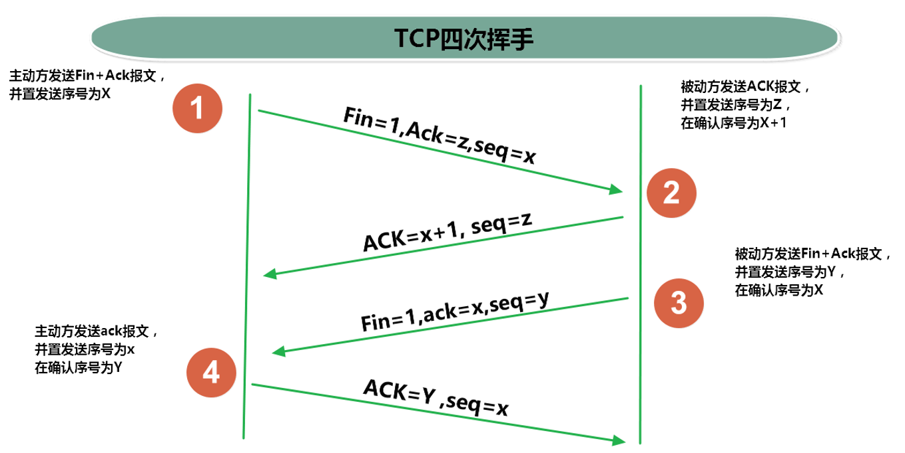

# 网络编程
## 网络编程

### 1. IP地址

> IP地址（Internet  Protocol）
> 唯一标识网络上的每一台计算机
> IP地址的组成
> 32位，由4个8位二进制数组成

> IP地址 = 网络地址 +主机地址
> ​	网络地址：标识计算机或网络设备所在的网段
> ​	主机地址：标识特定主机或网络设备

### 2. 端口号

> 端口号标识正在计算机上运行的进程（程序）
>
> 不同的进程有不同的端口号，一个 16 位的整数 0~65535。

### 3. DNS

> DNS：Domain Name System，域名系统
>
> 是一个分布式的数据库 负责将输入的域名与对应的IP地址进行匹配 解析 

### 4. 网络模型

> 网络模型属于使用网络进行数据传输的各个环节统称 
>
> 网络模型的存在是为了规范数据传输的各个细节 保证数据的安全性 
>
> 七层模型太过了理想化 未被实现 真正落地实现的 就是 五层模型


### 5. TCP协议数据传输

> TCP协议：面向连接的 安全的 可靠的传输协议

```java
package com.atguigu.test6;

import java.io.*;
import java.net.ServerSocket;
import java.net.Socket;

/**
 * @author WHD
 * @description TODO
 * @date 2023/8/25 15:11
 *  服务器类
 *
 *  TCP协议：面向连接的 安全的 可靠的传输协议
 *
 *
 *  ServerSocket 服务器端的Socket 套接字
 *
 */
public class Server {
    public static void main(String[] args) {
        try {
            // 创建服务器端Socket对象 端口号为 8899
            ServerSocket server = new ServerSocket(8899);

            System.out.println("服务器启动……");

            // 接收客户端请求 获取到Socket对象
            // accept()方法会等待用户发送请求 然后再继续向下执行
            Socket socket = server.accept();

            // 根据Socket对象 获取到 字节读取流
            InputStream inputStream = socket.getInputStream();

            // 根据字节读取流创建BufferedReader对象
            BufferedReader reader = new BufferedReader(new InputStreamReader(inputStream));

            // 读取数据
            System.out.println("客户端发送的信息为：" +  reader.readLine());

            System.out.println("-----------------------------------------------------");

            OutputStream outputStream = socket.getOutputStream();

            String message = "你好客户端";

            outputStream.write(message.getBytes());

            socket.shutdownOutput();

        } catch (IOException e) {
            e.printStackTrace();
        }
    }
}

```

```java
package com.atguigu.test6;

import java.io.*;
import java.net.Socket;

/**
 * @author WHD
 * @description TODO
 * @date 2023/8/25 15:11
 *  客户端类
 *  Socket 套接字 表示用于发送数据的断点
 *
 */
public class Client {
    public static void main(String[] args) {
        // 127.0.0.1 属于回环地址 表示本机
        // localhost 也表示本机
        try {
            // 创建客户端Socket对象 指定主机地址为本机 端口号为8899
            Socket socket = new Socket("localhost",8899);

            // 根据Socket对象获取到字节输出流
            OutputStream outputStream = socket.getOutputStream();

            // 准备信息
            String message = "你好，服务器";

            // 写入信息
            outputStream.write(message.getBytes());

            // 关闭输出流
            socket.shutdownOutput();

            System.out.println("---------------------------------------------------");

            InputStream inputStream = socket.getInputStream();

            BufferedReader reader = new BufferedReader(new InputStreamReader(inputStream));

            System.out.println("服务器的回话为：" +  reader.readLine());


        } catch (IOException e) {
            e.printStackTrace();
        }
    }
}

```

> 使用TCP协议 实现 多个客户端连接同一个服务器
>
> 分析：多个客户端属于多个线程 请求同一个服务器 服务器也应该使用不同的线程来处理不同的客户端
>
> 即 每次接收一个新的请求 就分配一个新的线程来处理对应的客户端

```java
package com.atguigu.test7;

import java.io.IOException;
import java.net.ServerSocket;
import java.net.Socket;

/**
 * @author WHD
 * @description TODO
 * @date 2023/8/25 15:27
 *  使用TCP协议 实现 多个客户端连接同一个服务器
 *  分析：多个客户端属于多个线程 请求同一个服务器 服务器也应该使用不同的线程来处理不同的客户端
 *  即 每次接收一个新的请求 就分配一个新的线程来处理对应的客户端
 *
 */
public class Server {
    public static void main(String[] args) {
        try {
            ServerSocket server  = new ServerSocket(8899);

            System.out.println("服务器启动……");

            while(true){
                Socket socket = server.accept();
                new ServerThread(socket).start();
            }
        } catch (IOException e) {
            e.printStackTrace();
        }
    }
}

```

```java
package com.atguigu.test7;

import java.io.*;
import java.net.Socket;

/**
 * @author WHD
 * @description TODO
 * @date 2023/8/25 15:29
 *  客户端1
 */
public class Client1 {
    public static void main(String[] args) {
        try {
            Socket socket = new Socket("127.0.0.1",8899);

            OutputStream outputStream = socket.getOutputStream();

            outputStream.write("你好服务器".getBytes());

            socket.shutdownOutput();

            InputStream inputStream = socket.getInputStream();

            BufferedReader reader = new BufferedReader(new InputStreamReader(inputStream));


            System.out.println("客户端的回话为：" + reader.readLine());


        } catch (IOException e) {
            e.printStackTrace();
        }
    }
}

```

```java
package com.atguigu.test7;

import java.io.*;
import java.net.Socket;

/**
 * @author WHD
 * @description TODO
 * @date 2023/8/25 15:29
 *  客户端2
 */
public class Client2 {
    public static void main(String[] args) {
        try {
            Socket socket = new Socket("127.0.0.1",8899);

            OutputStream outputStream = socket.getOutputStream();

            outputStream.write("睡了吗服务器".getBytes());

            socket.shutdownOutput();

            InputStream inputStream = socket.getInputStream();

            BufferedReader reader = new BufferedReader(new InputStreamReader(inputStream));


            System.out.println("客户端的回话为：" + reader.readLine());

        } catch (IOException e) {
            e.printStackTrace();
        }
    }
}

```

```java
package com.atguigu.test7;

import java.io.*;
import java.net.Socket;

/**
 * @author WHD
 * @description TODO
 * @date 2023/8/25 15:29
 *  客户端3
 */
public class Client3 {
    public static void main(String[] args) {
        try {
            Socket socket = new Socket("127.0.0.1",8899);

            OutputStream outputStream = socket.getOutputStream();

            outputStream.write("真的睡了吗服务器".getBytes());

            socket.shutdownOutput();

            InputStream inputStream = socket.getInputStream();

            BufferedReader reader = new BufferedReader(new InputStreamReader(inputStream));

            System.out.println("客户端的回话为：" + reader.readLine());

        } catch (IOException e) {
            e.printStackTrace();
        }
    }
}

```

```java
package com.atguigu.test7;

import java.io.*;
import java.net.InetAddress;
import java.net.Socket;
import java.nio.Buffer;

/**
 * @author WHD
 * @description TODO
 * @date 2023/8/25 15:32
 * 服务器线程类
 */
public class ServerThread extends Thread {
    private Socket socket;

    public ServerThread(Socket socket) {
        this.socket = socket;
    }

    @Override
    public void run() {
        InputStream inputStream = null;
        try {
            inputStream = socket.getInputStream();
            BufferedReader reader = new BufferedReader(new InputStreamReader(inputStream));
            InetAddress inetAddress = socket.getInetAddress();
            System.out.println( inetAddress.getHostName() + "发送的信息为：" + reader.readLine());


            OutputStream outputStream = socket.getOutputStream();

            outputStream.write("睡了".getBytes());

            socket.shutdownOutput();


        } catch (IOException e) {
            e.printStackTrace();
        }
    }
}

```

### 6. TCP三次握手四次挥手

> TCP协议的三次握手：
>
> ​		第一次：客户端向服务器发送连接请求
>
> ​		第二次：服务器向客户端响应连接请求
>
> ​		第三次：客户端与服务器建立连接


> TCP协议的四次挥手：
>
> ​		第一次：客户端向服务器发送断开连接请求
>
> ​		第二次：服务器向客服端响应收到断开连接请求(因为TCP连接是双向的，所以此时服务器依然可以 向客户端发送信息)
>
> ​		第三次：客户端等待服务器发送信息完成，向服务器确定全部信息发送完毕，并且断开客户端与服务器的连接
>
> ​		第四次：服务器向客户端断开连接



### 7. UDP协议

> UDP 用户数据报协议 非面向连接的 不安全 不可靠的传输协议 效率高

```java
package com.atguigu.test8;

import java.io.IOException;
import java.net.DatagramPacket;
import java.net.DatagramSocket;
import java.net.SocketException;

/**
 * @author WHD
 * @description TODO
 * @date 2023/8/25 16:07
 *  服务器端
 *  DatagramSocket
 *
 *  DatagramPacket
 */
public class Server {
    public static void main(String[] args) {
        try {
            // 准备Socket对象  指定端口号
            DatagramSocket socket = new DatagramSocket(8899);

            System.out.println("服务器启动");

            // 准备数组接收数据
            byte [] receiveData = new byte[10];

            // 准备数据包对象 指定接收数据的数组 和 大小
            DatagramPacket receivePacket = new DatagramPacket(receiveData, receiveData.length);

            // 接收数据 数据将保存在receivePacket对象中
            socket.receive(receivePacket);

            // 调用receivePacket对象的getData()方法 获取数据
            byte[] data = receivePacket.getData();

            // 解析数据
            System.out.println(new String(data, 0, data.length));

            // 服务器响应用户


        } catch (SocketException e) {
            e.printStackTrace();
        } catch (IOException e) {
            e.printStackTrace();
        }
    }
}

```

```java
package com.atguigu.test8;

import java.io.IOException;
import java.net.*;

/**
 * @author WHD
 * @description TODO
 * @date 2023/8/25 16:07
 * 客户端
 *
 * UDP 用户数据报协议 非面向连接的 不安全 不可靠的传输协议 效率高
 *
 */
public class Client {
    public static void main(String[] args) throws IOException {
        // 准备数据
        String message = "你好 服务器";

        // 转换为byte数组
        byte [] sendData = message.getBytes();

        // 获取地址对象
        InetAddress localhost = InetAddress.getByName("localhost");

        // 准备数据包
        // 第一个参数 数据
        // 第二个参数 数据大小
        // 第三个参数 发送地址
        // 第四个参数 端口号
        DatagramPacket sendPacket = new DatagramPacket(sendData,sendData.length,localhost,8899);

        // 准备DatagramSocket对象
        DatagramSocket socket = new DatagramSocket();

        // 发送数据
        socket.send(sendPacket);


        // 客户端接收用户数据 解析数据

    }
}

```

