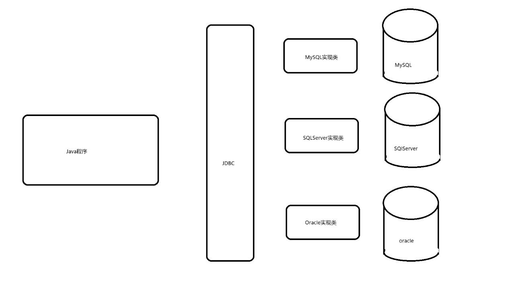

# MySQL

### 1. 准备工作

* 配置环境变量
  * 将安装目录配置C:\Program Files\MySQL\MySQL Server 8.0\bin 配置到环境变量Path变量中
* 设置服务自启动
  * 徽标+ R 输入 services.msc 打开服务设置面板 找到mysql80 右键设置为自启动
  * 通过cmd dos命令 net start mysql80 开启服务 net stop mysql80 关闭服务

### 2. SQL语句分类

|         |                                                              |
| ------- | ------------------------------------------------------------ |
| DDL语句 | 数据定义语句（Data Define Language），例如：创建（create），修改（alter），删除（drop）等 |
| DML语句 | 数据操作语句，例如：增（insert)，删（delete），改（update），查（select） |
| DCL语句 | 数据控制语句，例如：grant，commit，rollback等                |
| DQL     | 数据查询语句 select                                          |

### 3. 事务

#### 3.1 事务ACID原则

> 原子性（Automicity）：事务是一个整体 不可拆分 要么都执行 要么都不执行
>
> 一致性（Consistency）：事务执行前后数据保持一致 不能凭空消失
>
> 隔离性（Isolation）：事务与事务之间相互隔离 根据不同的隔离级别 有不同的效果
>
> 持久性（Durability）：通过事务最终提交的数据 将永久保存在磁盘上 无法回滚 

#### 3.2 事务隔离级别

> 事务的隔离级别：
>
> read-uncommitted; 读未提交 会产生脏读  
>
> read-committed; 读已提交 会产生不可重复读
>
> repeatable-read;可重复读 会产生幻读 
>
> serializable; 串行化 最安全 不会产生任何问题   

```sql
#**原子性（Automicity）**
# 原子性是指事务是一个不可分割的工作单位，事务中的操作要么都发生，要么都不发生。 

# **一致性（Consistency）**
# 事务必须使数据库从一个一致性状态变换到另外一个一致性状态。

# **隔离性（Isolation）**
#事务的隔离性是指一个事务的执行不能被其他事务干扰，即一个事务内部的操作及使用的数据对并发的其他# 事务是隔离的，并发执行的各个事务之间不能互相干扰。

# **持久性（Durability）**
#持久性是指一个事务一旦被提交，它对数据库中数据的改变就是永久性的，接下来的其他操作和数据库故障# 不应该对其有任何影响


create table account(
	id int primary key auto_increment comment '账户编号',
	accname varchar(20) not null comment '账户名称',
	money int not null comment '账户金额'
);

insert into account(accname,money) values('赵四',5000),('大拿',0);


select * from account;
# mysql中的sql语句属于自动提交的 （即直接保存在硬盘上）
# 对于需要多个sql同时执行成功最终才提交的情况 需要在事务中实现 

# 开启事务 (关闭自动提交)

# set autocommit = false; 或者  set autocommit = 0 表示关闭自动提交 即通过sql执行的数据
# 将暂时保存在缓存中 等待多个sql全部执行完毕 最终确定没有问题 再提交 

start transaction; # 开启事务也会关闭自动提交 

update account set money = money - 1000 where id = 1;
update account set money = money + 1000 where id = 2;

rollback; # 回滚 恢复到事务执行之前的状态 事务会自动关闭
commit; # 提交 将会持久化数据 即永久保存在硬盘上 无法回滚


# 事务的隔离级别：
# read-uncommitted; 读未提交 会产生脏读  
# read-committed; 读已提交 会产生不可重复读
# repeatable-read;可重复读 会产生幻读 
# serializable; 串行化 最安全 不会产生任何问题   

# 查看当前隔离级别
select @@transaction_isolation;

set @@transaction_isolation = 'read-uncommitted';
```


## JDBC



> JDBC是SUN公司提供的一套规范 一套接口 位于java.sql包中    具体实现类 有各个厂商负责实现 来连接 各自的数据库
>
> 使用JDBC连接mysql数据

>  前提操作：
>
> 1.选中项目文件 右键new directory 创建名为lib的文件夹
>
> 2.将mysql jdbc对应的jar文件粘贴到此目录
>
> 3.选中lib文件夹 右键 add as library

```java
package com.atguigu.test1;

import java.sql.*;

/**
 * @author WHD
 * @description TODO
 * @date 2023/8/29 16:16
 *  JDBC是SUN公司提供的一套规范 一套接口 位于java.sql包中    具体实现类 有各个厂商负责实现 来连接 各自的数据库
 *  使用JDBC连接mysql数据
 *
 *  前提操作：
 *  1.选中项目文件 右键new directory 创建名为lib的文件夹
 *  2.将mysql jdbc对应的jar文件粘贴到此目录
 *  3.选中lib文件夹 右键 add as library
 *
 *
 *
 */
public class MySQLConnection {
    public static void main(String[] args) {

        try {
            // 加载驱动 通过反射实现
            Class.forName("com.mysql.cj.jdbc.Driver");


            // 获取连接对象
            String url = "jdbc:mysql://localhost:3306/db0724";
            String userName = "root";
            String password = "9999";
            Connection connection = DriverManager.getConnection(url, userName, password);


            // 根据连接对象获取执行SQL语句的对象
            Statement statement = connection.createStatement();

            // 编写SQL
            String sql = "select * from department";


            // 使用Statement对象 执行sql语句
            ResultSet resultSet = statement.executeQuery(sql);

            // 遍历结果集对象  resultSet
            while(resultSet.next()){

//                System.out.println(resultSet.getInt(1)); 根据列的序号获取数据 1表示第一列 2表示第2列 以此类推
                // 根据列名来获取数据 如果是int类型数据 getInt 如果是String类型 getString
                System.out.println(resultSet.getInt("depid"));
                System.out.println(resultSet.getString("depname"));

            }


        } catch (ClassNotFoundException e) {
            e.printStackTrace();
        } catch (SQLException e) {
            e.printStackTrace();
        }
    }
}

```

