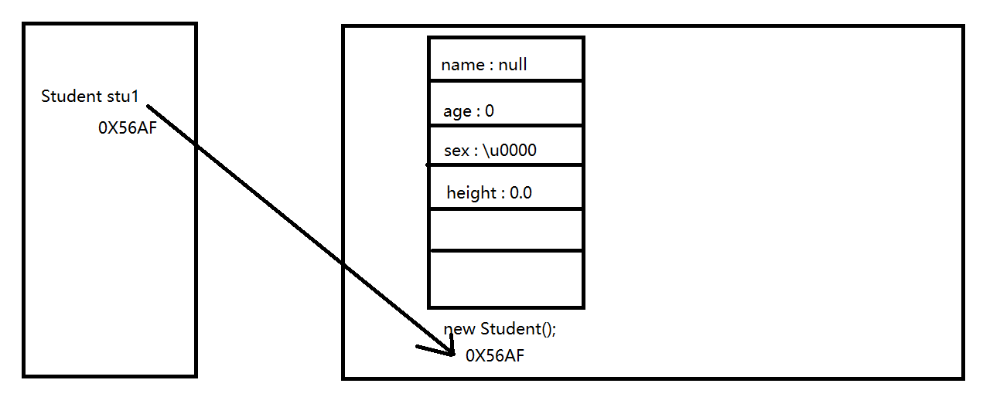

## 初识面向对象

### 1.内容介绍

* 知识点 ：封装、 继承、 多态、 static关键字、 访问权限修饰符、 final关键字、 抽象类、 接口……
* 学习周期：一周(五天)左右
* 内容特点对比：
  * 面向对象之前：知识点之间关联性不强，需要理解的不多，很多内容有固定的格式
  * 面向对象开始：知识点之间关联性很强，需要理解的很多，新的语法格式也很多，概念也很多
  * 总结：面向对象部分需要多理解，多思考，多练习

### 2.万物皆对象

> 自然界中的任何事物，都可以通过分析其特征和行为将其描述的完整，理解为一个对象。
>
> 对象就是现实世界中客观存在的一个实体、一个个例、一个实例

### 3.特征---属性

> 一类事物共同拥有的信息，称之为特征，在程序中使用属性来描述。

### 4.行为---方法

> 一类事物共同拥有的动作，称之为行为，在程序中使用方法来描述。

### 5.类和对象的关系

> 类是对象的抽象。类是一个抽象的概念，比如：人类，动物类，学生类等等……
>
> 对象是类的具体。对象是一个具体的概念，比如：赵四，家里的狗狗，小明同学等等……

### 6.编写类和创建对象

> 类和对象的关系：类是对象的抽象，对象是类的具体
>
>
> 学生类
>
> 特征--属性：姓名、年龄、性别、身高、体重、爱好、联系方式、学号
>
> 属性也叫成员变量，也叫实例变量，也叫字段 英文名称：field 字段
>
>
> 行为--方法：学习  吃饭  睡觉 ……
>
> 方法，也叫实例方法，注意，这里使用的方属于实例方法，也就是不能使用static修饰
>
> 英文名称：method 方法
>
>
> 静态方法和实例方法对比：
>
> 修饰关键字不同：静态方法有static关键字 实例方法没有
>
> 调用方式不同：静态方法直接书写方法名调用 实例方法必须先new对象 通过对象名加点调用
>
>
>
> 实例级别 也就是 对象级别

````java
package com.atguigu.test1;

/**
 * @author WHD
 * @description TODO
 * @date 2023/8/5 10:30
 *
 *  类和对象的关系：类是对象的抽象，对象是类的具体
 *
 *  学生类
 *  特征--属性：姓名、年龄、性别、身高、体重、爱好、联系方式、学号
 *  属性也叫成员变量，也叫实例变量，也叫字段 英文名称：field 字段
 *
 *  行为--方法：学习  吃饭  睡觉 ……
 *  方法，也叫实例方法，注意，这里使用的方属于实例方法，也就是不能使用static修饰
 *  英文名称：method 方法
 *
 *  静态方法和实例方法对比：
 *  修饰关键字不同：静态方法有static关键字 实例方法没有
 *  调用方式不同：静态方法直接书写方法名调用 实例方法必须先new对象 通过对象名加点调用
 *
 *
 *  实例级别 也就是 对象级别
 *
 */
public class Student {
    String name;
    int age;
    char sex;
    double height;
    double weight;
    String hobby;
    String phone;
    String studentNo;

    public void study(){
        System.out.println("学生在学习");
    }

    public void eat(){
        System.out.println("学生在吃饭");
    }

    public void sleep(){
        System.out.println("学生在睡觉");
    }


    public static void main(String[] args) {
        // 创建对象 格式：类名 对象名 =  new 类名();
        Student stu1 = new Student();

        // 使用对象名访问属性 给属性赋值   格式：对象名.属性名 = 值;
        stu1.name = "赵四";
        stu1.age = 20;
        stu1.sex = '男';
        stu1.studentNo = "sz999";
        stu1.height = 175.5;
        stu1.weight = 85;
        stu1.phone = "784512457889";
        stu1.hobby = "尬舞";

        // 使用对象名访问方法 格式：对象名.方法名();
        stu1.study();
        stu1.eat();
        stu1.sleep();

        System.out.println("----------------------------------------------------");

        Student stu2 = new Student();
        stu2.name = "广坤";
        stu2.age = 18;
        stu2.sex = '男';
        stu2.studentNo = "sz888";
        stu2.hobby = "口技";
        stu2.phone = "5623124578454555";
        stu2.height = 175.6;
        stu2.weight = 82.5;

        stu2.study();
        stu2.sleep();
        stu2.eat();


    }


}

````

### 7. 实例变量



| 描述     | 局部变量                                           | 实例变量                                                 |
| -------- | -------------------------------------------------- | -------------------------------------------------------- |
| 定义位置 | 方法或方法内的结构当中                             | 类的内部，方法的外部                                     |
| 默认值   | 无默认值                                           | 有默认值（与数组相同）                                   |
| 使用范围 | 从定义行到包含其结构结束                           | 本类有效                                                 |
| 命名冲突 | 不允许重名                                         | 可与局部变量重名，局部变量优先                           |
| 存储位置 | 基本数据类型存在栈中，引用数据类型名字在栈，值在堆 | 因为实例属性保存在对象中，而对象存在堆中，全部存储在堆中 |
| 生命周期 | 随着方法的入栈而生效，随着方法的出栈而死亡         | 随着对象的创建而存在 随着对象被垃圾回收(GC)而死亡        |

```java
package com.atguigu.test2;

/**
 * @author WHD
 * @description TODO
 * @date 2023/8/5 10:30
 *  学生类
 *  特征--属性：姓名、年龄、性别、身高、体重、爱好、联系方式、学号
 *  行为--方法：学习  吃饭  睡觉 ……
 *
 *  实例变量
 *      定义位置：直接定义在类中
 *      作用范围：整个类中都可以访问
 *      重名问题：可以与局部变量重名 局部变量优先使用 就近原则
 *      默认值：有默认值 与数组相同
 *      存储位置：因为实例属性保存在对象中，而对象存在堆中，全部存储在堆中
 *      生命周期：随着对象的创建而存在 随着对象被垃圾回收(GC)而死亡
 *
 */
public class Student {
    String name;
    int age;
    char sex;
    double height;
    double weight;
    String hobby;
    String phone;
    String studentNo;

    public void study(){
        String name = "hello world";
        System.out.println(name + "学生在学习");
    }

    public void eat(){
        System.out.println(name + "学生在吃饭");
    }

    public void sleep(){
        System.out.println(name + "学生在睡觉");
    }

    public void printStudent(){
        System.out.println("我的名字是" + name);
        System.out.println("我的年龄是" + age);
        System.out.println("我的身高是" + height);
        System.out.println("我的体重是" + weight);
        System.out.println("我的性别是" + sex);
        System.out.println("我的学号是" + studentNo);
        System.out.println("我的电话是" + phone);
        System.out.println("我的爱好是" + hobby);
    }


    public static void main(String[] args) {
        Student stu1 = new Student();

        stu1.name = "赵四";
        stu1.age = 20;
        stu1.sex = '男';
        stu1.studentNo = "sz999";
        stu1.height = 175.5;
        stu1.weight = 85;
        stu1.phone = "784512457889";
        stu1.hobby = "尬舞";

        stu1.study();
        stu1.eat();
        stu1.sleep();
        System.out.println("----------------------------------------------------");

        stu1.printStudent();

        System.out.println("----------------------------------------------------");

        Student stu2 = new Student();
        stu2.name = "广坤";
        stu2.age = 18;
        stu2.sex = '男';
        stu2.studentNo = "sz888";
        stu2.hobby = "口技";
        stu2.phone = "5623124578454555";
        stu2.height = 175.6;
        stu2.weight = 82.5;

        stu2.study();
        stu2.sleep();
        stu2.eat();
        System.out.println("----------------------------------------------------");

        Student stu3 = new Student();

        stu3.printStudent();


    }


}

```

### 8. 构造方法

> 构造方法：用于创建对象的特殊方法
>
> 书写格式：访问修饰符 +  类名(){}
>
> 特点：
>
> ​	名称与类名完全相同。
>
> ​	没有返回值类型。
>
> ​	创建对象时，触发构造方法的调用，不可通过句点手动调用
>
> 作用：构造方法是用于属性初始化的
>
> 有参构造方法可以在创建对象的同时 给属性赋值 但并不是用来取代对象名加点的方式给属性赋值的
>
> 实际开发中，我们只会书写两个构造方法，即可满足95%的开发场景：无参 和 全参构造

> 关于无参构造：如果没有在类中显示定义构造方法，则编译器默认提供无参构造方法。如果定义了有参构造
>
> 方法，则无参构造方法将会被覆盖，如需使用，必须显式书写。

> 构造方法重载：同一个类中的构造方法 参数列表不同

```java
package com.atguigu.test3;

/**
 * @author WHD
 * @description TODO
 * @date 2023/8/5 10:30
 *  学生类
 *  特征--属性：姓名、年龄、性别、身高、体重、爱好、联系方式、学号
 *  行为--方法：学习  吃饭  睡觉 ……
 *
 *  构造方法：用于创建对象的特殊方法
 *  书写格式：访问修饰符 +  类名(){}
 *  特点：
 *      名称与类名完全相同。
 *      没有返回值类型。
 *      创建对象时，触发构造方法的调用，不可通过句点手动调用
 *  作用：构造方法是用于属性初始化的
 *
 *  有参构造方法可以在创建对象的同时 给属性赋值 但并不是用来取代对象名加点的方式给属性赋值的
 *
 *  实际开发中，我们只会书写两个构造方法，即可满足95%的开发场景：无参 和 全参构造
 *
 * 重点：如果没有在类中显示定义构造方法，则编译器默认提供无参构造方法。如果定义了有参构造方法，则无参构造
 * 方法将会被覆盖，如需使用，必须显式书写。
 *
 * 构造方法重载：同一个类中的构造方法 参数列表不同
 *
 *
 */
public class Student {
    String name;
    int age;
    char sex;
    double height;
    String hobby;

    public void printStudent(){
        System.out.println("我的名字是" + name);
        System.out.println("我的年龄是" + age);
        System.out.println("我的身高是" + height);
        System.out.println("我的性别是" + sex);
        System.out.println("我的爱好是" + hobby);
    }

    public  Student(){
        System.out.println("Student类无参构造方法执行了");
    }

    public Student(String n){
        name = n;
    }

    public Student(String n,int a){
        name = n;
        age = a;
    }

    public Student(int a,String n){
        name = n;
        age = a;
    }

    public Student(String n,int a,char s){
        name = n;
        age = a;
        sex = s;
    }

    public Student(String n,int a,char s,double h){
        name = n;
        age = a;
        sex = s;
        height = h;
    }

    public Student(String n,int a,char s,double h,String ho){
        System.out.println("Student类有参构造方法执行了");
        name = n;
        age = a;
        sex = s;
        height = h;
        hobby = ho;
    }

    public static void main(String[] args) {
        Student stu1 = new Student();
        stu1.printStudent();
        System.out.println("----------------------------------------------------------------------");
        Student stu2 = new Student("赵四", 20, '男', 180.5, "尬舞");
        stu2.printStudent();
        System.out.println("----------------------------------------------------------------------");

        Student stu3 = new Student(20, "大拿");
        stu3.sex = '男';
        stu3.height = 177;
        stu3.hobby = "挣钱";
        stu3.printStudent();

    }


}

```

### 9.this关键字

> 学生类
>
> 特征--属性：姓名、年龄、性别、身高、体重、爱好、联系方式、学号
>
> 行为--方法：学习  吃饭  睡觉 ……
>
>
> this关键字：this 表示当前对象 当前正在使用的对象
>
> this可以访问本类中的
>
> ​	实例属性：this.属性名
>
> ​	实例方法: this.方法名()  也可以直接书写方法名调用 两种方式没有任何差异 实例与实例互相直接调用
>
> ​	构造方法: this(实参列表) this访问构造方法 必须在本类构造的第一句

```java
package com.atguigu.test4;

/**
 * @author WHD
 * @description TODO
 * @date 2023/8/5 10:30
 *  学生类
 *  特征--属性：姓名、年龄、性别、身高、体重、爱好、联系方式、学号
 *  行为--方法：学习  吃饭  睡觉 ……
 *
 *  this关键字：this 表示当前对象 当前正在使用的对象
 *  this可以访问本类中的
 *      实例属性：this.属性名
 *      实例方法: this.方法名()  也可以直接书写方法名调用 两种方式没有任何差异 实例与实例互相直接调用
 *      构造方法: this(实参列表) this访问构造方法 必须在本类构造的第一句
 *
 *
 */
public class Student {
    String name;
    int age;
    char sex;
    double height;
    String hobby;


    public void printName(){
        System.out.println("我的名字是" + name);
    }
    public void printAge(){
        System.out.println("我的年龄是" + age);
    }

    public void printStudent(){
        this.printName();
        printAge();
        System.out.println("我的年龄是" + age);
        System.out.println("我的身高是" + height);
        System.out.println("我的性别是" + sex);
        System.out.println("我的爱好是" + hobby);
    }

    public  Student(){
        System.out.println("Student类无参构造执行了");
    }
    public Student(String name){
        this.name = name;
    }

    public Student(int age){
        this.age = age;
    }
    public Student(String name,int age){
        this(name);
        this.age = age;
    }
    public Student(String name, int age, char sex){
        this(name,age);
        this.sex = sex;
    }
    public Student(String name, int age, char sex, double height){
        this(name,age,sex);
        this.height = height;
    }
    public Student(String name, int age, char sex, double height, String hobby){
        this(name,age,sex,height);
        this.hobby = hobby;
    }

    public static void main(String[] args) {
        Student stu1 = new Student("赵四", 20, '男', 177, "尬舞");
        stu1.printStudent();
    }


}

```


