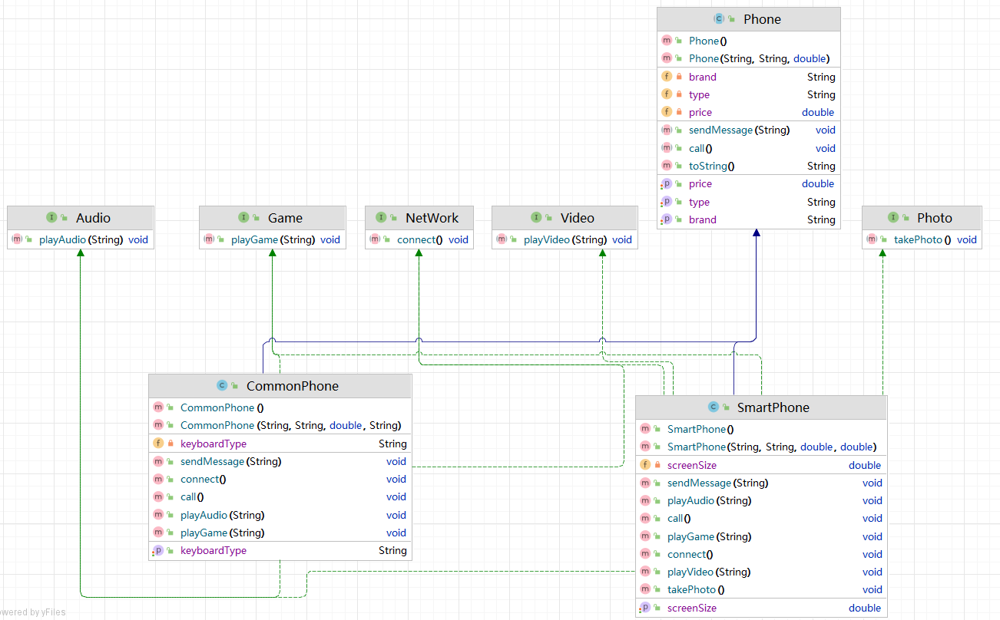
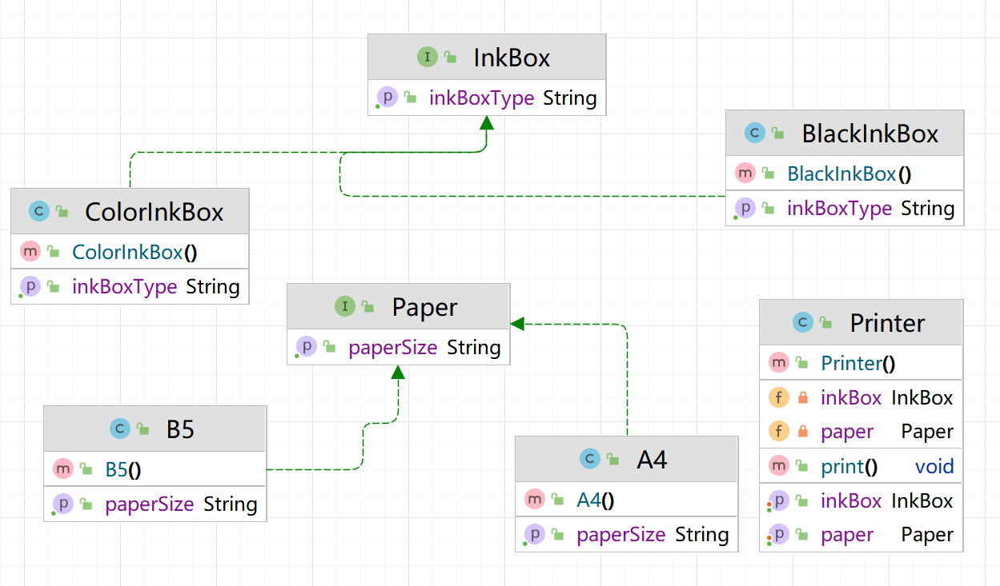

## 抽象类和接口

### 1.抽象类

> 1.抽象方法没有方法体 必须存在于抽象类 均使用abstract修饰
>
> 2.抽象类不能直接new对象 必须通过new子类的方式创建对象(多态向上转型)
>
> 3.子类必须重写抽象类中的所有抽象方法 除非子类也是抽象类
>
> 4.抽象类中可以书写普通属性 普通方法 静态方法 构造方法
>
> 5.抽象类作为父类 实现多态的方式与之前一致

```java
package com.atguigu.test2;

/**
 * @author WHD
 * @description TODO
 * @date 2023/8/11 10:52
 *  动物类
 *  abstract ： 抽象
 */
public abstract class Animal {
    // 属性
    private String animalType;

    public String getAnimalType() {
        return animalType;
    }

    public void setAnimalType(String animalType) {
        this.animalType = animalType;
    }

    public Animal(String animalType) {
        this.animalType = animalType;
    }

    public Animal() {
    }

    public static void m1(){
        System.out.println("Animal类中的m1方法 ");
    }

    // 方法

    /**
     *  1.抽象方法没有方法体 必须存在于抽象类 均使用abstract修饰
     *  2.抽象类不能直接new对象 必须通过new子类的方式创建对象(多态向上转型)
     *  3.子类必须重写抽象类中的所有抽象方法 除非子类也是抽象类
     *  4.抽象类中可以书写普通属性 普通方法 静态方法 构造方法
     *  5.抽象类作为父类 实现多态的方式与之前一致
     */
    public abstract void eat();
}

```

```java
package com.atguigu.test2;

/**
 * @author WHD
 * @description TODO
 * @date 2023/8/11 11:08
 */
public class Tiger extends Animal{
    @Override
    public void eat() {
        System.out.println("老虎吃肉");
    }
}

```

```java
package com.atguigu.test2;

/**
 * @author WHD
 * @description TODO
 * @date 2023/8/11 11:11
 */
public abstract class Pet extends Animal{

    public abstract void playWithMaster();

}

```

```java
package com.atguigu.test2;

/**
 * @author WHD
 * @description TODO
 * @date 2023/8/11 11:14
 */
public class Dog extends Pet{
    @Override
    public void eat() {
        System.out.println("狗狗吃骨头");
    }

    @Override
    public void playWithMaster() {
        System.out.println("狗狗和主人玩飞盘");
    }
}

```

```java
package com.atguigu.test2;

/**
 * @author WHD
 * @description TODO
 * @date 2023/8/11 11:04
 *  类是对象的抽象
 *  对象是类的具体
 */
public class TestAnimal {
    public static void main(String[] args) {
        Animal tiger = new Tiger();
        tiger.eat();

        Animal dog1 = new Dog();
        dog1.eat();


        Pet dog2 = new Dog();
        dog2.eat();
        dog2.playWithMaster();


    }
}

```

### 2. 抽象类实现多态

```java
package com.atguigu.test3;

/**
 * @author WHD
 * @description TODO
 * @date 2023/8/11 14:09
 *  父类： 门
 *  子类：防盗门   普通门
 */
public abstract class Door {
    private String brand;
    private double price;

    public String getBrand() {
        return brand;
    }

    public void setBrand(String brand) {
        this.brand = brand;
    }

    public double getPrice() {
        return price;
    }

    public void setPrice(double price) {
        this.price = price;
    }

    public abstract  void open();

    public abstract void close();

    public Door(String brand, double price) {
        this.brand = brand;
        this.price = price;
    }

    public Door() {
    }
}

```

```java
package com.atguigu.test3;

/**
 * @author WHD
 * @description TODO
 * @date 2023/8/11 14:13
 */
public class CommonDoor extends Door{

    @Override
    public void open() {
        System.out.println("普通门开门，插入钥匙，轻轻一转，zhi~ya一声，门开了");
    }

    @Override
    public void close() {
        System.out.println("普通门关门，随手关门，duang的一声，门关了");
    }
}

```

```java
package com.atguigu.test3;

/**
 * @author WHD
 * @description TODO
 * @date 2023/8/11 14:15
 */
public class SecurityDoor extends Door{
    private String password;

    public String getPassword() {
        return password;
    }

    public void setPassword(String password) {
        this.password = password;
    }

    public SecurityDoor(String brand, double price, String password) {
        super(brand, price);
        this.password = password;
    }

    public SecurityDoor() {

    }

    @Override
    public void open() {
        System.out.println("防盗门开门，输入密码，按下指纹，门自动打开");
    }

    @Override
    public void close() {
        System.out.println("防盗门关门，障碍物识别，自动关门");
    }
}

```

```java
package com.atguigu.test3;

/**
 * @author WHD
 * @description TODO
 * @date 2023/8/11 14:16
 *  人类
 */
public class Person {
    public void openCommonDoor(CommonDoor cd){
        cd.open();
    }

    public void closeCommonDoor(CommonDoor cd){
        cd.close();
    }

    public void openSecurityDoor(SecurityDoor sd){
        sd.open();
    }

    public void closeSecurityDoor(SecurityDoor sd){
        sd.close();
    }
    // 以上方式分别针对不同的门的种类编写了开和关的方法 如果后续有更多的门的种类
    // 还需要继续编写更多的方法 这样设计不合理  不符合开闭原则
    // -------------------------------------------------------------

    public void openDoor(Door door){
        door.open();
    }

    public void closeDoor(Door door){
        door.close();
    }

    // -------------------------------------------------------------

    public Door buyDoor(double money){
        if(money > 300){
            return new SecurityDoor();
        }else{
            return new CommonDoor();
        }
    }


}

```

```java
package com.atguigu.test3;

/**
 * @author WHD
 * @description TODO
 * @date 2023/8/11 14:23
 */
public class TestPerson {
    public static void main(String[] args) {
        Person person = new Person();

        CommonDoor commonDoor = new CommonDoor();
        commonDoor.setBrand("小金刚");
        commonDoor.setPrice(200);

        SecurityDoor securityDoor = new SecurityDoor();
        securityDoor.setBrand("大金刚");
        securityDoor.setPrice(500);

        person.openDoor(commonDoor);
        person.openDoor(securityDoor);

        person.closeDoor(commonDoor);
        person.closeDoor(securityDoor);

        System.out.println("-------------------------------------------------------");

        Door door = person.buyDoor(500);
        door.open();
        door.close();

        System.out.println("-------------------------------------------------------");


        Door [] doors = new Door[2];

        doors[0] = new CommonDoor();
        doors[1] = new SecurityDoor();


    }
}

```

### 3.final关键字

#### 3.1 修饰属性

> 修饰属性：被final修饰的属性称之为常量 名称全部大写 多个单词之间使用下划线分割  常量只能被赋值一次
>
> 通常(99%)在定义的时候赋值 或者 在构造方法中赋值 这两种方式都是为了保证在使用常量之前是有值的
>
> ​	基本数据类型：值不能被改变
>
> ​	引用数据类型：地址不能被改变 地址中的内容(属性)是可以改变

```java
package com.atguigu.test4;

/**
 * @author WHD
 * @description TODO
 * @date 2023/8/11 15:09
 *  final关键字：修饰属性、方法、类
 *  修饰属性：被final修饰的属性称之为常量 名称全部大写 多个单词之间使用下划线分割  常量只能被赋值一次
 *  通常(99%)在定义的时候赋值 或者 在构造方法中赋值 这两种方式都是为了保证在使用常量之前是有值的
 *      基本数据类型：值不能被改变
 *      引用数据类型：地址不能被改变 地址中的内容(属性)是可以改变
 */
public class TestFinalFiled {
    final double PI = 3.14;
    final int SEAT_COUNT;

    final char [] SIGNS = new char[3];
    public TestFinalFiled(){
        SEAT_COUNT = 60;
    }
    public TestFinalFiled(double radius) {
        SEAT_COUNT = 70;
        this.radius = radius;
    }

    double radius;

    public static void main(String[] args) {
        TestFinalFiled testFinalFiled = new TestFinalFiled();
//        testFinalFiled.pi = 3.24;
        testFinalFiled.radius = 10;
        System.out.println(testFinalFiled.radius * testFinalFiled.radius * testFinalFiled.PI);

      // testFinalFiled.SIGNS = new char[2];

        testFinalFiled.SIGNS[0] = 'a';
        testFinalFiled.SIGNS[1] = 'b';
        testFinalFiled.SIGNS[2] = 'c';
    }

}

```

> 被final修饰的属性称之为常量 表示其值或者地址不能被改变
>
> 这样的数据通常也没有必要存在多份 所以实际开发中经常会用static final修饰不允许被改变的数据
>
> 因为只有一份 且 数据无法改变 所以通常也会再加上public修饰 称之为：全局 静态 常量
>
>
> 静态常量：通常在定义的时候赋值 或者 在静态代码块中赋值 这两种方式同样是为了保证在使用常量之前是有值的

```java
package com.atguigu.test4;

/**
 * @author WHD
 * @description TODO
 * @date 2023/8/11 15:25
 *  被final修饰的属性称之为常量 表示其值或者地址不能被改变
 *  这样的数据通常也没有必要存在多份 所以实际开发中经常会用static final修饰不允许被改变的数据
 *  因为只有一份 且 数据无法改变 所以通常也会再加上public修饰 称之为：全局 静态 常量
 *
 *  静态常量：通常在定义的时候赋值 或者 在静态代码块中赋值 这两种方式同样是为了保证在使用常量之前是有值的
 *
 */
public class TestStaticFinalField {
    public static final double PI = 3.14;

    static final String COUNTRY_NAME;

    static{
        COUNTRY_NAME =   "中华人民共和国";
    }

    public TestStaticFinalField() {

    }
}

```


#### 3.2 修饰方法

> final修饰的方法不能被子类重写

```java
package com.atguigu.test4;

/**
 * @author WHD
 * @description TODO
 * @date 2023/8/11 15:31
 *  final修饰的方法不能被子类重写
 */
public class TestFinalMethod {
}
class A{
    public final void m1(){
        System.out.println("A类m1方法");
    }

    public void m2(){
        System.out.println("A类m2方法");
    }
}

class B extends A{
    public void m2(){

    }
}

```


#### 3.3 修饰类

> 被final修饰的类不能被继承  String类就是使用final修饰的

```java
package com.atguigu.test4;

/**
 * @author WHD
 * @description TODO
 * @date 2023/8/11 15:36
 *  被final修饰的类不能被继承  String类就是使用final修饰的
 */
public class TestFinalClass {
    public static void main(String[] args) {

    }
}

final class C{

}

class D {

}

```


### 4. 接口

> 1.接口中的方法默认都为全局抽象方法 即不管是否书写均使用public abstract修饰
>
> 2.接口不能直接new对象 必须通过new实现类(子类)的方式创建对象 (多态向上转型)
>
> 3.实现类(子类)必须实现(重写)接口中的所有抽象方法 除非实现类是抽象类 或者 是 接口
>
> 4.接口中不能书写普通属性、普通方法、构造方法、静态方法
>
> 5.一个类只能继承一个父类  一个实现类可以实现多个接口 接口也可以继承多个接口
>
> 6.接口实现多态的方式与之前一致

> 面试题：Java支持多继承？
>
> 不支持 但是可以使用接口继承多个接口的方式 实现类似多继承的效果

```java
package com.atguigu.test5;

/**
 * @author WHD
 * @description TODO
 * @date 2023/8/11 16:12
 *  面试题：Java支持多继承？
 *  不支持 但是可以使用接口继承多个接口的方式 实现类似多继承的效果
 */
public interface USB {
    int A = 100; // 默认为全局静态常量 不管是否书写 均使用public static final修饰

    /**
     *  1.接口中的方法默认都为全局抽象方法 即不管是否书写均使用public abstract修饰
     *  2.接口不能直接new对象 必须通过new实现类(子类)的方式创建对象 (多态向上转型)
     *  3.实现类(子类)必须实现(重写)接口中的所有抽象方法 除非实现类是抽象类 或者 是 接口
     *  4.接口中不能书写普通属性、普通方法、构造方法、静态方法
     *  5.一个类只能继承一个父类  一个实现类可以实现多个接口 接口也可以继承多个接口
     *  6.接口实现多态的方式与之前一致
     */
    void connect();


}

```

```java
package com.atguigu.test5;

import com.atguigu.test5.USB;

/**
 * @author WHD
 * @description TODO
 * @date 2023/8/11 16:20
 */
public class Mouse implements USB {
    @Override
    public void connect() {
        System.out.println("鼠标连接USB接口，可以操作电脑了");
    }
}

```

```java
package com.atguigu.test5;

/**
 * @author WHD
 * @description TODO
 * @date 2023/8/11 16:22
 */
public abstract class Converter implements  USB{
    /**
     *  转换方法 举例：网线转换器 需要执行转换功能  将水晶头网线转换为USB接口进行传输
     */
    public abstract void convert();
}

```

```java
package com.atguigu.test5;

/**
 * @author WHD
 * @description TODO
 * @date 2023/8/11 16:24
 */
public class UGreenConverter extends Converter{
    @Override
    public void convert() {
        System.out.println("绿联转换器执行水晶头网络转换");
    }

    @Override
    public void connect() {
        System.out.println("绿联转换器连接USB接口");
    }
}

```

```java
package com.atguigu.test5;

/**
 * @author WHD
 * @description TODO
 * @date 2023/8/11 16:21
 */
public class TestUSB {
    public static void main(String[] args) {
        USB usb = new Mouse();
        usb.connect();

        System.out.println("------------------------------------------------");

        USB convert = new UGreenConverter();
        convert.connect();
        System.out.println("------------------------------------------------");
        Converter converter = new UGreenConverter();
        converter.connect();
        converter.convert();

    }
}

```

### 5. 接口实现手机



> 接口是一种能力，实现一个接口，即表示具备一个能力，实现多个接口，即表示具备多个能力
>
> 关心实现类有何能力，而不关心实现细节
>
> 面向接口的约定而不考虑接口的具体实现 

> 当前案例中，能不能将五个抽象方法全部书写在一个接口中呢？
>
> 不推荐，不可以，因为如果书写在一个接口中，将增加程序的耦合性，即任何一个手机子类实现了这个接口，将必须重写这个五个抽象方法，即拥有五个功能，将不能根据市场需求灵活的生产不同档次的手机产品。

```java
package com.atguigu.test1;

/**
 * @author WHD
 * @description TODO
 * @date 2023/8/12 9:33
 *  手机类 父类
 *  属性：品牌 型号 价格
 *  方法：打电话 发短信
 */
public abstract class Phone {
    private String brand;
    private String type;
    private double price;


    public String getBrand() {
        return brand;
    }

    public void setBrand(String brand) {
        this.brand = brand;
    }

    public String getType() {
        return type;
    }

    public void setType(String type) {
        this.type = type;
    }

    public double getPrice() {
        return price;
    }

    public void setPrice(double price) {
        this.price = price;
    }

    public Phone() {

    }

    public Phone(String brand, String type, double price) {
        this.brand = brand;
        this.type = type;
        this.price = price;
    }

    public abstract void call();

    public abstract void sendMessage(String message);


    @Override
    public String toString() {
        return "Phone{" +
                "brand='" + brand + '\'' +
                ", type='" + type + '\'' +
                ", price=" + price +
                '}';
    }
}

```

```java
package com.atguigu.test1;

/**
 * @author WHD
 * @description TODO
 * @date 2023/8/12 9:35
 */
public class CommonPhone extends Phone implements NetWork,Audio,Game{
    private String keyboardType;

    public String getKeyboardType() {
        return keyboardType;
    }

    public void setKeyboardType(String keyboardType) {
        this.keyboardType = keyboardType;
    }

    public CommonPhone() {
    }

    public CommonPhone(String brand, String type, double price, String keyboardType) {
        super(brand, type, price);
        this.keyboardType = keyboardType;
    }

    @Override
    public void call() {
        System.out.println("普通手机打电话，按键拨号，体验还行");
    }

    @Override
    public void sendMessage(String message) {
        System.out.println("普通手机发短信，按键打字，体验一般：" + message);
    }

    @Override
    public void playAudio(String audioName) {
        System.out.println("普通手机播放音乐，音质感人：" + audioName);
    }

    @Override
    public void playGame(String game) {
        System.out.println("普通手机打游戏，体验一般：" + game);
    }

    @Override
    public void connect() {
        System.out.println("普通手机连接2G网络，体验很一般");
    }
}

```

```java
package com.atguigu.test1;

/**
 * @author WHD
 * @description TODO
 * @date 2023/8/12 9:36
 *  智能手机
 */
public class SmartPhone extends Phone implements NetWork,Video,Audio,Photo,Game{
    private double screenSize;

    public double getScreenSize() {
        return screenSize;
    }

    public void setScreenSize(double screenSize) {
        this.screenSize = screenSize;
    }

    public SmartPhone() {

    }

    public SmartPhone(String brand, String type, double price, double screenSize) {
        super(brand, type, price);
        this.screenSize = screenSize;
    }

    @Override
    public void call() {
        System.out.println("智能手机打电话，语音拨号，体验很不错");
    }

    @Override
    public void sendMessage(String message) {
        System.out.println("智能手机发短信，手写输入，体验很棒：" + message);
    }

    @Override
    public void playAudio(String audioName) {
        System.out.println("智能手机播放音频，音质很棒：" + audioName);
    }

    @Override
    public void playGame(String game) {
        System.out.println("智能手机打游戏，体验很丝滑：" + game);
    }

    @Override
    public void connect() {
        System.out.println("智能手机连接6G网络，飞一般的感觉");
    }

    @Override
    public void takePhoto() {
        System.out.println("智能拍照，1亿像素，咔嚓一下记录美好，记录你我");
    }

    @Override
    public void playVideo(String videoName) {
        System.out.println("智能手机播放视频，很清晰：" + videoName);
    }
}

```

```java
package com.atguigu.test1;

/**
 *  播放音频接口
 */
public interface Audio {
    void playAudio(String audioName);
}

```

```java
package com.atguigu.test1;

/**
 *  打游戏接口
 */
public interface Game {
    void playGame(String game);
}

```

```java
package com.atguigu.test1;

/**
 *  联网接口
 */
public interface NetWork {
    void connect();
}

```

```java
package com.atguigu.test1;

/**
 *  拍照接口
 */
public interface Photo {
    void takePhoto();
}

```

```java
package com.atguigu.test1;

/**
 *  播放视频接口
 */
public interface Video {
    void playVideo(String videoName);
}

```

```java
package com.atguigu.test1;

/**
 * @author WHD
 * @description TODO
 * @date 2023/8/12 9:52
 */
public class TestPhone {
    public static void main(String[] args) {
        SmartPhone huawei = new SmartPhone("华为", "mate 50 PRO MAX PLUS", 9.9, 25);

        huawei.connect();
        huawei.call();
        huawei.sendMessage("睡了吗？");
        huawei.playVideo("《小猪佩奇成人版》");
        huawei.playAudio("《最炫民族风》");
        huawei.playGame("《原神》");
        huawei.takePhoto();

        System.out.println("-------------------------------------------------------------------------------");

        CommonPhone nokia = new CommonPhone("诺基亚", "N97", 8.8, "九键");

        nokia.connect();
        nokia.sendMessage("真的睡了吗？");
        nokia.call();
        nokia.playAudio("《发如雪》");
        nokia.playGame("《贪吃蛇》");


    }
}

```

### 6. 接口实现打印机

> 接口是一种约定，即表示一种规范
>
> 程序设计时面向接口的约定而不考虑具体实现 



> 纸张是一种规范，接口也是一种规范，因为纸张有我们公认的执行标准。

```java
package com.atguigu.test2;

/**
 * @author WHD
 * @description TODO
 * @date 2023/8/12 10:40
 *  打印机类
 *  属性：墨盒 和 纸张
 *  方法：打印
 */
public class Printer {
    private InkBox inkBox;
    private Paper paper;

    public void setInkBox(InkBox inkBox){
        this.inkBox = inkBox;
    }
    public InkBox getInkBox(){
        return inkBox;
    }
    public void setPaper(Paper paper){
        this.paper = paper;
    }
    public Paper getPaper(){
        return paper;
    }


    public void print(){
        System.out.println("使用" + this.getInkBox().getInkBoxType() + "墨盒在" + this.getPaper().getPaperSize() + "纸张上打印");
    }


}

```

````java
package com.atguigu.test2;

/**
 *  墨盒接口
 */
public interface InkBox {
    /**
     *  获取墨盒的具体类型
     * @return
     */
    String getInkBoxType();
}

````

```java
package com.atguigu.test2;

/**
 * @author WHD
 * @description TODO
 * @date 2023/8/12 10:42
 */
public class BlackInkBox implements  InkBox{
    @Override
    public String getInkBoxType() {
        return "黑色";
    }
}

```

```java
package com.atguigu.test2;

/**
 * @author WHD
 * @description TODO
 * @date 2023/8/12 10:43
 * 彩色墨盒
 */
public class ColorInkBox implements  InkBox{
    @Override
    public String getInkBoxType() {
        return "彩色";
    }
}

```

```java
package com.atguigu.test2;

/**
 *  纸张接口
 */
public interface Paper {
    /**
     *  返回纸张具体的型号
     * @return
     */
    String getPaperSize();
}

```

```java
package com.atguigu.test2;

/**
 * @author WHD
 * @description TODO
 * @date 2023/8/12 10:41
 *  A4纸
 */
public class A4 implements Paper{
    @Override
    public String getPaperSize() {
        return "A4";
    }
}

```

```java
package com.atguigu.test2;

/**
 * @author WHD
 * @description TODO
 * @date 2023/8/12 10:41
 *  B5纸张
 */
public class B5 implements  Paper{
    @Override
    public String getPaperSize() {
        return "B5";
    }
}

```

```java
package com.atguigu.test2;


/**
 * @author WHD
 * @description TODO
 * @date 2023/8/12 10:49
 */
public class Test {
    public static void main(String[] args) {
        Printer hp = new Printer();
        Paper a4 = new A4();
        Paper b5 = new B5();
        InkBox black = new BlackInkBox();
        InkBox color = new ColorInkBox();
        hp.setPaper(a4);
        hp.setInkBox(black);

        hp.print();


    }
}

    
```

### 7. 接口和抽象类

> 什么时候使用接口，什么时候使用抽象类呢？
>
> 推荐使用组合，即使用接口实现，因为类只能继承一个父类
>
> 当你关注事物的本质，使用抽象类
>
> 当你关注某个功能，使用接口