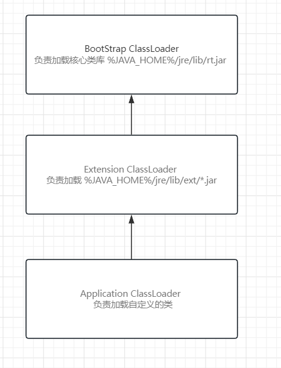

## 注解和反射

### 1. 注解

#### 1.1 注解介绍

> 注解
>
> 回顾我们之前接触、使用过的注解 @Override @FunctionalInterface @SuppressWarnings("unused")
>
> 不同的注解 有不同的作用 可以添加在不同的位置 有的可以写值 有的不能写值
>
> 注解：是JDK1.5新加入的内容
>
> Java web开发历程：
>
> web项目中会存在大量的配置文件 xml yml properties文件 等等 配置文件阅读性差 编写错误不能立即提示等等
>
> 配置文件会增加代码的复杂程度
>
> JDK开发人员在1.5引入了注解 用于来替代配置文件
>
> 早期：Java代码 + 配置文件
>
> 现在：Java代码 + 配置文件 + 注解
>
> 注解的优点：简化开发 提高代码可读性  
>
> 思想：约定大于配置

#### 1.2 元注解

> 元注解：用于修饰注解的注解
>
> `@Target` 决定注解可以添加在哪些位置 默认不写表示在任何位置都可以添加 表示此注解可以添加在
>
> ​	TYPE 类上 接口 抽象类
>
> ​	FIELD 属性
>
> ​	METHOD 方法
>
> ​	PARAMETER 形参
>
> ​	CONSTRUCTOR 构造器
>
> ​	LOCAL_VARIABLE 局部变量
>
> ​	ANNOTATION_TYPE 注解
>
> `@Inherited `被此注解修饰的注解 表示可以被子类继承
>
> `@Retention` 决定注解的生命周期(保留阶段 、 时期)
>
> ​	CLASS 表示在二进制文件中生效
>
> ​	SOURCE 表示在源代码中生效
>
> ​	RUNTIME 表示在运行期间生效
>
> ​	默认不写表示为CLASS
>
> `@Documented` 被此注解修饰的注解 可以生成在帮助文档中

#### 1.3 注解属性类型

> 注解属性支持的数据类型：8种基本数据类型 ，Class类型，String类型，枚举类型 和其对应的数组类型

#### 1.4 注解属性赋值规则

>  注解中的每一个属性必须赋值 否则将无法编译通过,除非给属性使用default关键字加上默认值
>
> 如果注解中只有一个属性 并且属性名为value 那么可以直接写值 其他的情况都必须写为 属性名 = 属性值
>
> 如果属性为数组 单个元素直接写值 多个元素使用大括号包括 逗号分割书写

### 2.反射

####  2.1 反射介绍

> 反射： 在程序运行期间 动态的获取类对象 从而使用类对象获取类中相关的信息 并且访问
>
> 不通过new对象的方式 依然可以访问类中的属性、方法、构造方法
>
>
> 生活中的反射：倒车镜  拍X光片  IDE的自动提示
>
>
> 万物皆对象 类、属性、方法、构造器 也属于对象
>
>
> java.lang.Class 类类 每一个类都将在类加载阶段自动产生此类的实例
>
> java.lang.reflect.Field 字段/属性类 任何一个属性都属于此类的实例
>
> java.lang.reflect.Method 方法类 任何一个方法都属于此类的实例
>
> java.lang.Constructor 构造器类 任何一个构造器都属于此类的实例

#### 2.2 获取Class对象四种方式

> 获取Class对象
>
> 1.Class.forName(String 全限定名) ： 使用Class类中的静态方法 获取Class对象
>
> 2.使用类名.class
>
> 3.使用Object类中的getClass() 方法 获取到Class对象
>
> 4.使用类加载器
>
> Class类中的 newInstance() 方法 ：调用此方法表示创建当前Class对象所对应 泛型的对象

```java
package com.atguigu.test7;

/**
 * @author WHD
 * @description TODO
 * @date 2023/8/23 14:53
 *  反射： 在程序运行期间 动态的获取类对象 从而使用类对象获取类中相关的信息 并且访问
 *  不通过new对象的方式 依然可以访问类中的属性、方法、构造方法
 *
 *  生活中的反射：倒车镜  拍X光片  IDE的自动提示
 *
 *  万物皆对象 类、属性、方法、构造器 也属于对象
 *
 *  java.lang.Class 类类 每一个类都将在类加载阶段自动产生此类的实例
 *  java.lang.reflect.Field 字段/属性类 任何一个属性都属于此类的实例
 *  java.lang.reflect.Method 方法类 任何一个方法都属于此类的实例
 *  java.lang.Constructor 构造器类 任何一个构造器都属于此类的实例
 *
 *  获取Class对象
 *  1.Class.forName(String 全限定名) ： 使用Class类中的静态方法 获取Class对象
 *  2.使用类名.class
 *  3.使用Object类中的getClass() 方法 获取到Class对象
 *  4.使用类加载器
 *
 *  Class类中的 newInstance() 方法 ：调用此方法表示创建当前Class对象所对应 泛型的对象
 *
 *
 */
public class Note {
    public static void main(String[] args) throws ClassNotFoundException, InstantiationException, IllegalAccessException {
        // 方式1 Class.forName(String 全限定名)
        Class<?> noteClass1 = Class.forName("com.atguigu.test7.Note");

        Object o = noteClass1.newInstance();


        // 方式2 使用类名.class
        Class<Note> noteClass = Note.class;
        Note note1 = noteClass.newInstance();

        // 方式3 使用Object类中的getClass() 方法

        Note note = new Note();
        Class<? extends Note> aClass = note.getClass();
        Note note2 = aClass.newInstance();


    }
}

```

#### 2.3 使用反射

> 使用反射解决之前宠物系统中 抽奖送宠物的问题
>
> 之前的实现方案：根据用户传入对应的参数 来创建对象的宠物子类对象 返回 
>
> 这样编写有一个问题，因为是直接硬编码的方式 创建对象 所以 我们考虑到未来可能会存在的奖项 即新的宠物子类 所以 这样的书写方法 扩展性较差
>
> 使用反射的方式解决：在编码期间并不直接写明具体创建哪个子类对象 而是根据调用者传入的全限定名来创建对象 这样 更加灵活 扩展性更强 不会受限于硬编码的局限 

```java
package com.atguigu.test8;

/**
 * @author WHD
 * @description TODO
 * @date 2023/8/9 14:23
 * 主人类
 * 2.抽奖送宠物
 * 一等奖 送企鹅一只
 * 二等奖 送狗狗一只
 * 三等奖 送猫咪一只
 * 幸运奖 送成年东北虎一只
 */
public class Master {


    public Pet givePet(String str) {
        if (str.equals("一等奖")) {
            Penguin penguin = new Penguin("小白", 100, 100, '雄');
            return penguin;
        } else if (str.equals("二等奖")) {
            Dog dog = new Dog("大黄", 100, 100, "金毛");
            return dog;
        } else if (str.equals("三等奖")) {
            return new Cat();
        } else {
            return new Tiger();
        }
    }

    public Pet givePetWithReflect(String subClassName) throws Exception {
        Pet pet = null;
        Class<?> subClass = Class.forName(subClassName);
        Object o = subClass.newInstance();
        if (o instanceof Pet) {
            pet = (Pet) o;
        }
        return pet;
    }

    public static void main(String[] args) throws Exception {
        Master master = new Master();
        Pet pet = master.givePetWithReflect("com.atguigu.test8.Bear");
        System.out.println(pet);

    }


}

```

#### 2.4 获取属性


> java.lang.reflect.Filed类 属性类
>
>
> Field getField(String fieldName) 根据字段名称获取到一个public修饰的字段对象
>
> Field [] getFields() 获取本类中所有的public修饰的字段 返回值类型为Field类型的数组
>
>
> 步骤：
>
> 1.先获取到Class对象
>
> 2.在通过Class对象 调用对应的方法 获取到字段对象

```java
package com.atguigu.test9;

import java.lang.reflect.Field;

/**
 * @author WHD
 * @description TODO
 * @date 2023/8/23 15:55
 *  java.lang.reflect.Filed类 属性类
 *
 *  Field getField(String fieldName) 根据字段名称获取到一个public修饰的字段对象
 *  Field [] getFields() 获取本类中所有的public修饰的字段 返回值类型为Field类型的数组
 *
 *  步骤：
 *      1.先获取到Class对象
 *      2.在通过Class对象 调用对应的方法 获取到字段对象
 */
public class TestField1 {
    public static void main(String[] args) {
        try {
            // 使用反射获取Class对象
            Class<?> stuClass = Class.forName("com.atguigu.test9.Student");

            // 获取所有的public修饰的字段对象
            Field[] fields = stuClass.getFields();

            // 遍历字段数组
            for (Field field : fields) {
                // 打印字段信息  名字 类型 访问修饰符
                System.out.println(field.getName() + "===" + field.getType() + "===" + field.getModifiers());
            }

            System.out.println("----------------------------------------------------");

            // 根据名称获取单个字段对象
            Field field4 = stuClass.getField("field4");

            // 使用Class对象 创建对应的学生类对象
            Object o = stuClass.newInstance();

            // 设置值
            // 第一个参数 表示给哪个对象的属性赋值
            // 第二个数 属性值
            field4.set(o,'赵');

            // 打印对象
            System.out.println(o);

        } catch (ClassNotFoundException e) {
            e.printStackTrace();
        } catch (NoSuchFieldException e) {
            e.printStackTrace();
        } catch (IllegalAccessException e) {
            e.printStackTrace();
        } catch (InstantiationException e) {
            e.printStackTrace();
        }

    }
}

```

> Field [] getDeclaredFields()  获取到本类中所有的已定义的字段 返回值为字段数组
>
> Field getDeclaredField(String name) 根据字段名称获取到单个字段对象

```java
package com.atguigu.test9;

import java.lang.reflect.Field;

/**
 * @author WHD
 * @description TODO
 * @date 2023/8/23 16:10
 *  Field [] getDeclaredFields()  获取到本类中所有的已定义的字段 返回值为字段数组
 *  Field getDeclaredField(String name) 根据字段名称获取到单个字段对象
 */
public class TestField2 {
    public static void main(String[] args) throws Exception {
        // 获取Student类 class对象
        Class<?> stuClass = Class.forName("com.atguigu.test9.Student");

        // 获取所有的已定义的字段对象 返回值为字段数组
        Field[] declaredFields = stuClass.getDeclaredFields();

        // 遍历字段数组
        for (Field declaredField : declaredFields) {
            // 打印字段信息 名字 类型 访问修饰符
            System.out.println(declaredField.getName() + "-" + declaredField.getType() + "-" + declaredField.getModifiers());
        }

        System.out.println("----------------------------------------------------");

        // 根据名称获取到单个字段对象
        Field field1 = stuClass.getDeclaredField("field1");

        // 通过Student类 Class对象 创建 Student类实例
        Object obj = stuClass.newInstance();

        field1.setAccessible(true); // 表示忽略JVM的安全检查 即可以不在同类中访问私有属性

        // 属性赋值
        // 第一个参数 表示给哪个对象的此属性赋值
        // 第二根参数 具体值
        field1.set(obj,"abc");

        // 获取属性值 参数表示获取哪个对象的此属性的值
        System.out.println(field1.get(obj));

    }
}

```

#### 2.5 获取方法

> java.lang.reflect.Method : 方法类 所有方法都属于此类的实例
>
>
> Class类中的方法
>
> getMethods() 获取本类中所有public修饰的方法 以及 继承自父类的方法
>
> getMethod(String methodName,Class....parameterType) 根据方法名称 以及形参列表获取到单个 本类中
>
> public修饰的方法 或者继承自父类的方法

```java
package com.atguigu.test1;

import java.lang.reflect.InvocationTargetException;
import java.lang.reflect.Method;

/**
 * @author WHD
 * @description TODO
 * @date 2023/8/25 9:06
 *  java.lang.reflect.Method : 方法类 所有方法都属于此类的实例
 *
 *  Class类中的方法
 *  getMethods() 获取本类中所有public修饰的方法 以及 继承自父类的方法
 *  getMethod(String methodName,Class....parameterType) 根据方法名称 以及形参列表获取到单个 本类中
 *  public修饰的方法 或者继承自父类的方法
 *
 */
public class TestMethod1 {
    public static void main(String[] args) {
        try {
            Class<?> stuClass = Class.forName("com.atguigu.test1.Student");

            Method[] methods = stuClass.getMethods();

            for (Method method : methods) {
                System.out.println(method.getName() + "===" + method.getParameterCount());
            }

            System.out.println("-----------------------------------------------");

            Method m4 = stuClass.getMethod("m4");

            Object obj = stuClass.newInstance();

            m4.invoke(obj);

            System.out.println("-----------------------------------------------");

            Method m41 = stuClass.getMethod("m4", int.class);

            m41.invoke(obj, 100);

            System.out.println("-----------------------------------------------");

            Method m42 = stuClass.getMethod("m4", int.class, String.class);

            m42.invoke(obj,123,"hello world");


        } catch (ClassNotFoundException e) {
            e.printStackTrace();
        } catch (NoSuchMethodException e) {
            e.printStackTrace();
        } catch (InvocationTargetException e) {
            e.printStackTrace();
        } catch (InstantiationException e) {
            e.printStackTrace();
        } catch (IllegalAccessException e) {
            e.printStackTrace();
        }


    }
}

```

> getDeclaredMethod(String methodName,Class<?>....parameterType) 根据方法名称 和 形参列表获取
>
> 本类中任意一个方法 不包括父类的
>
>
> getDeclaredMethods() 获取本类中所有已定义的方法 不包括父类的

```java
package com.atguigu.test1;

import java.lang.reflect.Method;

/**
 * @author WHD
 * @description TODO
 * @date 2023/8/25 9:22
 *  getDeclaredMethod(String methodName,Class<?>....parameterType) 根据方法名称 和 形参列表获取
 *  本类中任意一个方法 不包括父类的
 *
 *  getDeclaredMethods() 获取本类中所有已定义的方法 不包括父类的
 */
public class TestMethod2 {
    public static void main(String[] args) throws Exception {
        Class<?> stuClass = Class.forName("com.atguigu.test1.Student");

        Method[] methods = stuClass.getDeclaredMethods();

        for (Method method : methods) {
            System.out.println(method.getName() + "---" + method.getParameterCount());
        }
        System.out.println("---------------------------------------------------------");

        Method m1 = stuClass.getDeclaredMethod("m1");

        Object obj = stuClass.newInstance();

        m1.setAccessible(true); // 忽略JVM安全检查 即不再抛出权限不足异常 即可以访问

        m1.invoke(obj);


        System.out.println("---------------------------------------------------------");

        Method m11 = stuClass.getDeclaredMethod("m1", int.class);

        m11.setAccessible(true);

        m11.invoke(obj, 456);


    }
}

```


#### 2.6 获取构造方法

> ava.lang.reflect.Constructor 类 所有构造器都属于此类的实例
>
>
> Class类中的方法
>
> getConstructors() 获取本类中所有public修饰的构造器
>
> getConstructor(Class<?>... parameterTypes)  根据形参列表获取单个public修饰的构造器对象
>
>
> Class类中的newInstance() 无参 表示调用当前类对象中的无参构造创建对象
>
> Constructor类中的newInstance(Object ... args) 有参数 表示根据传入的参数列表 调用对应的构造方法创建对象

```java
package com.atguigu.test2;

import java.lang.reflect.Constructor;

/**
 * @author WHD
 * @description TODO
 * @date 2023/8/25 9:31
 *  java.lang.reflect.Constructor 类 所有构造器都属于此类的实例
 *
 *  Class类中的方法
 *  getConstructors() 获取本类中所有public修饰的构造器
 *  getConstructor(Class<?>... parameterTypes)  根据形参列表获取单个public修饰的构造器对象
 *
 *  Class类中的newInstance() 无参 表示调用当前类对象中的无参构造创建对象
 *  Constructor类中的newInstance(Object ... args) 有参数 表示根据传入的参数列表 调用对应的构造方法创建对象
 *
 */
public class TestConstructors1 {
    public static void main(String[] args) throws Exception {
        Class<?> stuClass = Class.forName("com.atguigu.test2.Student");

        Constructor<?>[] cons = stuClass.getConstructors();

        for (Constructor<?> con : cons) {

            System.out.println(con.getName() + "---" + con.getParameterCount());
        }

        System.out.println("------------------------------------------------------");


        Constructor<?> con1 = stuClass.getConstructor();


        Object o1 = con1.newInstance();

        System.out.println("o1 = " + o1);


        System.out.println("------------------------------------------------------");


        Constructor<?> con2 = stuClass.getConstructor(int.class, char.class, String.class);

        Object o2 = con2.newInstance(147, '男', "hello world");

        System.out.println("o2 = " + o2);


    }
}

```

> 获取本类中所有的构造器对象
>
>
> getDeclaredConstructors() 获取本类中所有访问修饰符修饰的构造器
>
> getDeclaredConstructor(Class<?>... parameterTypes)  根据形参列表获取单个所有访问修饰符修饰的构造器

```java
package com.atguigu.test2;

import java.lang.reflect.Constructor;

/**
 * @author WHD
 * @description TODO
 * @date 2023/8/25 9:44
 *  获取本类中所有的构造器对象
 *
 *  getDeclaredConstructors() 获取本类中所有访问修饰符修饰的构造器
 *  getDeclaredConstructor(Class<?>... parameterTypes)  根据形参列表获取单个所有访问修饰符修饰的构造器
 *
 */
public class TestConstructors2 {
    public static void main(String[] args) throws Exception {
        Class<?> stuClass = Class.forName("com.atguigu.test2.Student");

        Constructor<?>[] cons = stuClass.getDeclaredConstructors();

        for (Constructor<?> con : cons) {
            System.out.println(con.getName() + "---" + con.getParameterCount());
        }

        System.out.println("--------------------------------------------");

        Constructor<?> con1 = stuClass.getDeclaredConstructor(String.class);

        con1.setAccessible(true);

        Object obj1 = con1.newInstance("赵四");

        System.out.println("obj1 = " + obj1);

        System.out.println("--------------------------------------------");

        Constructor<?> con2 = stuClass.getDeclaredConstructor(int.class, String.class);

        Object obj2 = con2.newInstance(456, "hello world");

        System.out.println("obj2 = " + obj2);


    }
}

```

#### 2.7 获取注解

> 注解和反射进行结合：
>
> 1.先获取到当前类对象 即Class对象
>
> 2.根据Class对象获取到本类中所有的属性
>
> 3.根据属性对象获取到属性上方添加的注解对象
>
> 4.根据注解对象获取到属性值
>
> getAnnotation(Class<T> annotationClass) 根据传入的注解类型获取当前对象上方添加的单个注解对象 包含继承自父类的注解对象
>
> getAnnotations() 获取当前对象上方添加的所有注解对象 包含继承自父类的注解对象
>
>
>
> getDeclaredAnnotation(Class<T> annotationClass) 根据传入的注解类型获取当前对象上方添加的单个注解对象 不包含继承自父类的注解对象
>
> getDeclaredAnnotations() 获取当前对象上方添加的所有注解对象 不包含继承自父类的注解对象

```java
package com.atguigu.test3;

import java.lang.reflect.Field;

/**
 * @author WHD
 * @description TODO
 * @date 2023/8/25 10:12
 *  此类用于记录数据库连接信息  DBUtil
 *  用户名
 *  密码
 *  连接地址
 *  驱动
 *
 *  注解和反射进行结合：
 *  1.先获取到当前类对象 即Class对象
 *  2.根据Class对象获取到本类中所有的属性
 *  3.根据属性对象获取到属性上方添加的注解对象
 *  4.根据注解对象获取到属性值
 *
 *  getAnnotation(Class<T> annotationClass) 根据传入的注解类型获取当前对象上方添加的单个注解对象 包含继承自父类的注解对象
 *  getAnnotations() 获取当前对象上方添加的所有注解对象 包含继承自父类的注解对象
 *
 *
 *  getDeclaredAnnotation(Class<T> annotationClass) 根据传入的注解类型获取当前对象上方添加的单个注解对象 不包含继承自父类的注解对象
 *  getDeclaredAnnotations() 获取当前对象上方添加的所有注解对象 不包含继承自父类的注解对象
 *
 */
public class TestDBInfo {
    @UserName(abc = "root")
    private String userName;

    @Password("9999")
    private String password;

    @URL("jdbc:mysql://localhost:3306/dbName")
    private String URL;

    @Driver("com.mysql.cj.jdbc.Driver")
    private String driver;

    public static void main(String[] args) throws ClassNotFoundException {
        Class<?> dbClass = Class.forName("com.atguigu.test3.TestDBInfo");

        Field[] fields = dbClass.getDeclaredFields();

        for (Field field : fields) {

            System.out.println(field.getName() + "--" + field.getType());

            // 判断某个属性上方是否添加了某个注解
            if(field.isAnnotationPresent(UserName.class)){
                UserName username = field.getAnnotation(UserName.class);
                System.out.println(username.abc());
            }


            if(field.isAnnotationPresent(Password.class)){
                Password password = field.getAnnotation(Password.class);
                System.out.println(password.value());
            }

            if(field.isAnnotationPresent(URL.class)){
                URL url = field.getAnnotation(URL.class);
                System.out.println(url.value());
            }

            if(field.isAnnotationPresent(Driver.class)){
                Driver driver = field.getAnnotation(Driver.class);
                System.out.println(driver.value());
            }
        }
    }

}

```

```java
package com.atguigu.test3;

import java.lang.annotation.ElementType;
import java.lang.annotation.Retention;
import java.lang.annotation.RetentionPolicy;
import java.lang.annotation.Target;

@Target(ElementType.FIELD)
@Retention(RetentionPolicy.RUNTIME)
public @interface Driver {
    String value();
}

```

```java
package com.atguigu.test3;

import java.lang.annotation.ElementType;
import java.lang.annotation.Retention;
import java.lang.annotation.RetentionPolicy;
import java.lang.annotation.Target;

@Target(ElementType.FIELD)
@Retention(RetentionPolicy.RUNTIME)
public @interface Password {
    String value();
}

```

```java
package com.atguigu.test3;

import java.lang.annotation.ElementType;
import java.lang.annotation.Retention;
import java.lang.annotation.RetentionPolicy;
import java.lang.annotation.Target;

@Target(ElementType.FIELD)
@Retention(RetentionPolicy.RUNTIME)
public @interface URL {
    String value();
}

```

```java
package com.atguigu.test3;

import java.lang.annotation.ElementType;
import java.lang.annotation.Retention;
import java.lang.annotation.RetentionPolicy;
import java.lang.annotation.Target;

@Target(ElementType.FIELD)
@Retention(RetentionPolicy.RUNTIME)
public @interface UserName {
    String abc();
}

```


### 3. JUnit框架

> JUnit Java Unit 单元测试框架 是一个单独用于Java测试的工具
>
> JUnit提供了很多注解 方便我们测试代码 在需要测试的某个方法上方 添加某个注解 就可以实现测试的效果
>
>
> @Test    表示当前方法可以独立执行
>
> @After 类中的每个实例方法执行之后 此方法会自动执行一次
>
> @Before 类中的每个实例方法执行之前 此方法会自动执行一次
>
> @AfterClass 类中的方法 执行之后 只执行一次 此注解只能添加在静态方法上
>
> @BeforeClass 当前类中的方法 执行之前 只执行一次 此注解只能添加在静态方法上
>
>
> 实际开发中 我们测试的代码 会单独保存在于src平级的test文件夹中
>
> 右键将此文件夹 标记为 测试资源根目录

```java
import org.junit.*;

/**
 * @author WHD
 * @description TODO
 * @date 2023/8/25 10:43
 *  JUnit Java Unit 单元测试框架 是一个单独用于Java测试的工具
 *  JUnit提供了很多注解 方便我们测试代码 在需要测试的某个方法上方 添加某个注解 就可以实现测试的效果
 *
 * @Test    表示当前方法可以独立执行
 * @After 类中的每个实例方法执行之后 此方法会自动执行一次
 * @Before 类中的每个实例方法执行之前 此方法会自动执行一次
 * @AfterClass 类中的方法 执行之后 只执行一次 此注解只能添加在静态方法上
 * @BeforeClass 当前类中的方法 执行之前 只执行一次 此注解只能添加在静态方法上
 *
 * 实际开发中 我们测试的代码 会单独保存在于src平级的test文件夹中
 * 右键将此文件夹 标记为 测试资源根目录
 */
public class TestJunit {

    @Before
    public void before(){
        System.out.println("当前类中的每个实例方法执行之前 此方法会自动执行一次 ");
    }
    @After
    public void after(){
        System.out.println("当前类中的每个实例方法执行之后 此方法会自动执行一次 ");
    }


    @BeforeClass
    public static void beforeClass(){
        System.out.println("*******当前类中的方法 执行之前 只执行一次*******");
    }

    @AfterClass
    public static void afterClass(){
        System.out.println("*******当前类中的方法 执行之后 只执行一次*******");
    }


    @Test
    public void m1(){
        System.out.println("hello world m1");
    }
    @Test
    public void m2(){
        System.out.println("hello world m2");
    }

    @Test
    public void m3(){
        System.out.println("hello world m3");
    }
}

```


### 4. 自定义MyTest

```java
package com.atguigu.test4;

import java.lang.annotation.ElementType;
import java.lang.annotation.Retention;
import java.lang.annotation.RetentionPolicy;
import java.lang.annotation.Target;

@Target(ElementType.METHOD)
@Retention(RetentionPolicy.RUNTIME)
public @interface MyTest {
}

```

```java
package com.atguigu.test4;


import java.lang.reflect.InvocationTargetException;
import java.lang.reflect.Method;

/**
 * @author WHD
 * @description TODO
 * @date 2023/8/25 11:06
 */
public class TestMyTest {
    @MyTest
    public void m1(){
        System.out.println("m1方法执行");
    }

    public static void main(String[] args) throws InstantiationException, IllegalAccessException, ClassNotFoundException, InvocationTargetException {
        Class<?> testClass = Class.forName("com.atguigu.test4.TestMyTest");

        Method[] methods = testClass.getDeclaredMethods();

        Object obj = testClass.newInstance();

        for (Method method : methods) {

            if(method.isAnnotationPresent(MyTest.class)){
                Object invoke = method.invoke(obj);

            }
        }

    }

}

```

### 5. 类加载器

> 类加载的作用：加载类

> 当程序主动使用某个类时，如果该类还未被加载到内存中，则系统会通过如下三个步骤来对该类进行初始化。
>
> `①加载类(load) ： 将类的class文件读入内存，并为之创建一个java.lang.Class对象。此过程由类加载器完成`
>
> 将class文件字节码内容加载到内存中，并将这些数据转换成方法区的运行时数据结构，然后生成一个代表这个类的java.lang.Class对象。这个加载的过程需要类加载器参与。
>
>
>
> `②链接(link) ： 将类的二进制数据合并到JRE中`
>
> 验证：确保加载的类信息符合JVM规范，例如：以cafe开头，没有安全方面的问题
>
> 准备：正式为类变量（static）分配内存并设置类变量默认初始值的阶段，这些内存都将在方法区中进行分配(静态区)。
>
> 解析：将类、接口、字段和方法的符号引用转为直接引用。
>
> `③初始化(Initialize) : JVM负责对类进行初始化`
>
> 执行类构造器<clinit>()方法的过程。类构造器<clinit>()方法是由编译期自动收集类中所有类变量的赋值动作和静态代码块中的语句合并产生的。（类构造器是构造类信息的，不是构造该类对象的构造器）。
>
> 当初始化一个类的时候，如果发现其父类还没有进行初始化，则需要先触发其父类的初始化。
>
> 虚拟机会保证一个类的<clinit>()方法在多线程环境中被正确加锁和同步。

> 类加载器的分类：
>
> BootStrap ClassLoader 负责加载核心类库 %JAVA_HOME%/jre/lib/rt.jar   rt 为 RunTime 的含义
>
> 此类加载底层为C++ 实现 在Java代码中无法获取
>
> Extension ClassLoader 负责加载 %JAVA_HOME%/jre/lib/ext/*.jar
>
> Application ClassLoader  负责加载自定义的类
>
> 自定义类加载器  继承ClassLoader类 重写 findClass方法

> `双亲委派模型/机制：`
>
> `当JVM通过类加载器加载某一个类 会先委托给上级类加载器来加载 如果 上级类加载器中无法加载 再向下由`
>
> `子加载器加载`
>
> `这样做的目的是为了防止 人为的编写和JDK包名类名完全相同的类 污染，入侵JDK的源代码`


